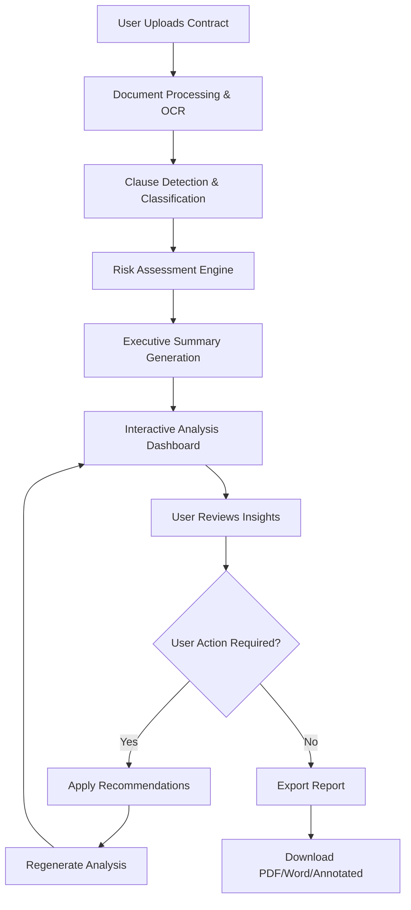

# HelloACA Contract Analysis Page Restructure - Product Requirements Document

## 1. Product Overview

This document outlines the comprehensive restructuring of the HelloACA Contract Analysis page to deliver a professional-grade, lawyer-credible contract analysis experience. The new system will transform raw AI analysis into actionable, visually compelling insights that clients can understand and act upon within 30 seconds.

**Target Market**: Legal professionals, freelancers, small businesses, and individuals who need reliable contract analysis without legal jargon.

**Core Value Proposition**: Read like a lawyer, write like a human - providing credible, actionable contract analysis with visual risk assessment and clear next steps.

## 2. Core Features

### 2.1 User Roles

| Role | Registration Method | Core Permissions |
|------|---------------------|------------------|
| Free User | Email registration | 3 contract analyses per month, basic PDF export |
| Premium User | Subscription upgrade | Unlimited analyses, advanced PDF reports, Word export, priority support |
| Enterprise User | Contact sales | Bulk analysis, API access, white-label reports, custom branding |

### 2.2 Feature Module

The restructured Contract Analysis page consists of the following main components:

1. **Executive Summary Dashboard**: One-page snapshot with contract story, risk score, and key metrics
2. **Interactive Clause Analysis**: Clause-by-clause breakdown with risk indicators and recommendations
3. **Risk Assessment Matrix**: Overall scoring with category-level breakdown and visual heatmap
4. **Legal Insights Panel**: Contextual recommendations and action items
5. **Export Center**: Multiple format outputs (PDF, Word, annotated contract)
6. **Chat Interface**: AI-powered Q&A for contract clarification

### 2.3 Page Details

| Page Name | Module Name | Feature description |
|-----------|-------------|---------------------|
| Executive Summary | Contract Overview | Display contract type, parties, effective date, term, jurisdiction, payment amount, and one-line purpose summary |
| Executive Summary | Risk Score Card | Show overall contract safety score (0-100), risk distribution chart, and key risk indicators |
| Executive Summary | Quick Actions | Provide immediate action buttons for high-priority fixes and export options |
| Clause Analysis | Clause Detection Table | Interactive table showing original clause text, AI summary, risk level, and recommended actions |
| Clause Analysis | Risk Indicators | Color-coded risk levels (🔴 High, 🟠 Medium, 🟡 Low, 🟢 Safe) with visual indicators |
| Clause Analysis | Inline Recommendations | Contextual advice for each clause with specific suggested edits |
| Risk Assessment | Category Breakdown | Risk scoring by category (Payment, Termination, IP, Confidentiality, etc.) |
| Risk Assessment | Visual Heatmap | Interactive risk visualization showing risk distribution across contract sections |
| Risk Assessment | Trend Analysis | Compare current contract risk against industry benchmarks |
| Legal Insights | Contextual Advice | Personalized recommendations based on user role (freelancer vs company) |
| Legal Insights | Action Items | Prioritized list of recommended changes with implementation guidance |
| Legal Insights | Jurisdiction Analysis | Specific advice based on governing law and user location |
| Export Center | PDF Report Generation | Professional PDF report with executive summary, clause analysis, and recommendations |
| Export Center | Word Document Export | Editable Word document with track changes and comments |
| Export Center | Annotated Contract | Original contract with inline highlights and AI comments |
| Chat Interface | AI Q&A | Natural language interface for contract clarification questions |
| Chat Interface | Clause Explanation | Detailed explanation of specific clauses and their implications |

## 3. Core Process

### User Flow: Contract Analysis Process



### Analysis Workflow Steps

1. **Document Ingestion**: Upload PDF/Word, OCR if needed, structure into sections
2. **Clause Detection**: AI models classify each paragraph by contract type
3. **Risk Scoring**: Hybrid rule-based + ML scoring for each clause
4. **Summary Generation**: Plain-language summaries for legal text
5. **Recommendation Engine**: Context-aware advice based on user role and jurisdiction
6. **Visualization**: Interactive dashboard with risk heatmaps and charts
7. **Export Generation**: Multiple format outputs with professional styling

## 4. User Interface Design

### 4.1 Design Style

**Primary Colors**: 
- Professional Blue: `#1E40AF` (trust, reliability)
- Risk Red: `#DC2626` (high risk indicators)
- Success Green: `#059669` (safe clauses)
- Warning Orange: `#EA580C` (medium risk)
- Neutral Gray: `#6B7280` (secondary text)

**Typography**:
- Headings: Inter Bold (24px, 20px, 18px)
- Body: Inter Regular (16px, 14px)
- Risk Scores: Inter Bold (32px for main score)

**Layout Style**:
- Card-based design with subtle shadows
- Responsive grid system (12-column on desktop, 4-column on mobile)
- Sticky navigation for easy section jumping
- Progressive disclosure for detailed analysis

**Icons & Visual Elements**:
- Risk level indicators: 🔴🟠🟡🟢
- Contract section icons (📋💰⚖️🔒)
- Interactive tooltips and hover states
- Professional chart visualizations

### 4.2 Page Design Overview

| Component | Module | UI Elements |
|-----------|--------|-------------|
| Executive Summary | Contract Header | Contract type badge, parties display, effective date chip |
| Executive Summary | Risk Score Card | Large circular score (72/100), radial progress indicator, risk distribution donut chart |
| Executive Summary | Key Metrics | Horizontal stat cards for payment, term, jurisdiction, parties |
| Clause Analysis | Clause Table | Expandable rows with original text, AI summary, risk badge, action button |
| Clause Analysis | Risk Indicators | Color-coded badges with hover tooltips explaining risk level |
| Risk Assessment | Category Chart | Horizontal bar chart showing risk by category |
| Risk Assessment | Heatmap Grid | 5x5 grid showing risk distribution across contract sections |
| Legal Insights | Advice Cards | Card-based layout with icon, title, description, and action button |
| Export Center | Export Options | Three large cards (PDF, Word, Annotated) with preview thumbnails |

### 4.3 Responsiveness

**Desktop-First Design** with mobile optimization:
- Executive summary collapses to vertical stack on mobile
- Clause table becomes card-based layout on tablets
- Risk charts switch to simplified versions on small screens
- Sticky navigation becomes bottom tab bar on mobile
- Touch-optimized interactions with larger tap targets

## 5. Technical Requirements

### 5.1 Data Structure Enhancements

The analysis data structure needs to be enhanced to support the new requirements:

```typescript
interface EnhancedContractAnalysis {
  executive_summary: {
    contract_type: string;
    parties: Party[];
    effective_date: string;
    contract_term: string;
    jurisdiction: string;
    payment_amount: string;
    purpose_summary: string;
  };
  overall_risk_score: {
    total_score: number; // 0-100
    risk_distribution: {
      high: number;
      medium: number;
      low: number;
      safe: number;
    };
  };
  clause_analysis: ClauseAnalysis[];
  risk_by_category: RiskCategory[];
  legal_insights: LegalInsight[];
  recommendations: Recommendation[];
}
```

### 5.2 AI Prompt Requirements

The AI analysis prompt needs to be updated to generate the enhanced analysis format with:
- Executive summary with key contract details
- Clause-by-clause breakdown with risk scoring
- Contextual recommendations based on user role
- Category-level risk assessment
- Actionable legal insights

### 5.3 Performance Requirements

- **Initial Analysis**: < 30 seconds for standard contracts
- **Interactive Response**: < 2 seconds for user interactions
- **Export Generation**: < 5 seconds for PDF/Word reports
- **Mobile Performance**: Optimized for 3G connections

## 6. Success Metrics

### 6.1 User Experience Metrics
- **Time to Understanding**: Users should grasp key risks within 30 seconds
- **Action Rate**: 60% of users should apply at least one recommendation
- **Export Rate**: 40% of users should download analysis reports
- **Satisfaction Score**: Target 4.5/5 average rating

### 6.2 Technical Metrics
- **Analysis Accuracy**: 95% clause classification accuracy
- **Risk Assessment Precision**: 90% alignment with legal expert review
- **System Uptime**: 99.9% availability
- **Response Time**: < 2 seconds for interactive features

## 7. Implementation Phases

### Phase 1: Foundation (Week 1-2)
- Update data structures and type definitions
- Enhance AI prompt for new analysis format
- Implement basic executive summary component

### Phase 2: Core Features (Week 3-4)
- Build interactive clause analysis table
- Implement risk scoring visualization
- Add legal insights panel

### Phase 3: Advanced Features (Week 5-6)
- Create export functionality (PDF, Word, Annotated)
- Implement chat interface for Q&A
- Add role-based contextual recommendations

### Phase 4: Polish & Optimization (Week 7-8)
- Performance optimization and mobile responsiveness
- User testing and feedback incorporation
- Final styling and interaction polish

This PRD provides the comprehensive blueprint for transforming the HelloACA Contract Analysis page into a professional-grade tool that delivers credible, actionable contract insights with visual appeal and expert-level recommendations.