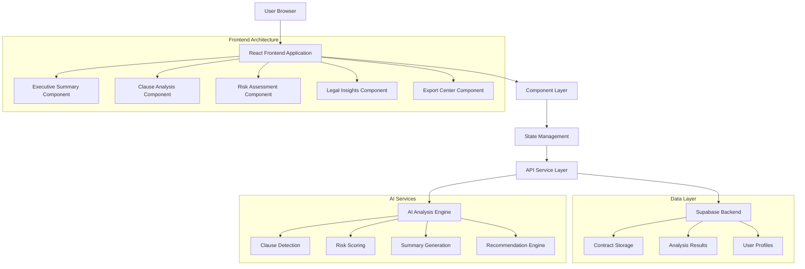

# HelloACA Contract Analysis Page Restructure - Technical Architecture Document

## 1. Architecture Design



## 2. Technology Description

**Frontend Stack:**
- React@18 + TypeScript@5 + Vite
- TailwindCSS@3 for styling with custom design system
- shadcn/ui components for consistent UI primitives
- React Query for data fetching and caching
- Zustand for lightweight state management
- Recharts for data visualization
- React PDF for PDF generation
- html2canvas for screenshot exports

**Backend Infrastructure:**
- Supabase (PostgreSQL + Authentication + Storage)
- Serverless functions for AI processing
- Edge functions for real-time features
- Row Level Security for data protection
 - CORS-enabled notification endpoint with OPTIONS preflight

**AI Integration:**
- Claude API for contract analysis
- Custom prompt engineering for legal domain
- Structured JSON output with validation
- Fallback mechanisms for AI failures
 - Mixpanel analytics with identity merge on sign-in (alias then identify)

**Export Functionality:**
- PDFKit for professional PDF generation
- Docx.js for Word document creation
- Custom annotation engine for contract markup
 - Branded footers and links updated to `https://preview.helloaca.xyz`

## 3. Enhanced Data Structures

### 3.1 Core TypeScript Interfaces

```typescript
// Enhanced Contract Analysis Types
export interface EnhancedContractAnalysis {
  metadata: {
    analysisId: string;
    contractId: string;
    userId: string;
    analysisDate: string;
    contractType: string;
    pageCount: number;
    wordCount: number;
    processingTime: number;
  };
  
  executive_summary: {
    contract_overview: {
      type: string;
      parties: Party[];
      effective_date: string;
      contract_term: string;
      jurisdiction: string;
      governing_law: string;
      total_value?: string;
      purpose_summary: string;
    };
    key_metrics: {
      risk_score: number; // 0-100
      safety_rating: 'Safe' | 'Moderate' | 'Risky' | 'Dangerous';
      complexity_level: 'Simple' | 'Standard' | 'Complex';
      estimated_review_time: string;
    };
    quick_insights: {
      biggest_risk: string;
      strongest_protection: string;
      most_important_clause: string;
      negotiation_priority: string;
    };
  };
  
  risk_assessment: {
    overall_score: number;
    risk_distribution: {
      critical: number;
      high: number;
      medium: number;
      low: number;
      safe: number;
    };
    category_breakdown: RiskCategory[];
    trend_analysis: {
      vs_industry_average: number;
      vs_similar_contracts: number;
      risk_trajectory: 'Improving' | 'Stable' | 'Declining';
    };
  };
  
  clause_analysis: {
    total_clauses: number;
    analyzed_clauses: number;
    clauses_by_section: ClauseSection[];
    critical_clauses: CriticalClause[];
    missing_clauses: MissingClause[];
  };
  
  legal_insights: {
    contextual_recommendations: Recommendation[];
    jurisdiction_specific: JurisdictionAdvice[];
    role_based_advice: RoleSpecificAdvice[];
    action_items: ActionItem[];
  };
  
  export_data: {
    pdf_template: string;
    word_template: string;
    annotations: ContractAnnotation[];
    charts_data: ChartData[];
  };
}

export interface Party {
  name: string;
  type: 'Individual' | 'Company' | 'Government' | 'Non-Profit';
  role: 'Client' | 'Service Provider' | 'Vendor' | 'Partner' | 'Other';
  legal_status: 'Verified' | 'Unverified' | 'Unknown';
  address?: string;
  registration_number?: string;
  authorized_representative?: string;
}

export interface RiskCategory {
  category: string;
  score: number;
  risk_level: 'Low' | 'Medium' | 'High' | 'Critical';
  clause_count: number;
  key_issues: string[];
  recommendations: string[];
}

export interface ClauseSection {
  section_name: string;
  section_type: string;
  clauses: AnalyzedClause[];
  section_risk_score: number;
  summary: string;
}

export interface AnalyzedClause {
  clause_id: string;
  original_text: string;
  ai_summary: string;
  risk_level: 'Safe' | 'Low' | 'Medium' | 'High' | 'Critical';
  risk_score: number;
  risk_factors: string[];
  recommendations: ClauseRecommendation[];
  legal_implications: string[];
  negotiation_priority: 'High' | 'Medium' | 'Low';
  similar_clauses?: string[];
  industry_standards?: string[];
}

export interface ClauseRecommendation {
  type: 'Language' | 'Structure' | 'Addition' | 'Removal';
  priority: 'Critical' | 'High' | 'Medium' | 'Low';
  description: string;
  suggested_language?: string;
  reasoning: string;
  implementation_notes: string;
}

export interface CriticalClause {
  clause_id: string;
  clause_type: string;
  risk_level: 'Critical';
  issues: string[];
  immediate_actions: string[];
  escalation_required: boolean;
  legal_review_recommended: boolean;
}

export interface Recommendation {
  id: string;
  category: 'Risk Mitigation' | 'Compliance' | 'Negotiation' | 'Clarity' | 'Protection';
  priority: 'Critical' | 'High' | 'Medium' | 'Low';
  title: string;
  description: string;
  implementation_steps: string[];
  estimated_impact: string;
  time_sensitivity: 'Immediate' | 'Short-term' | 'Long-term';
  user_role_context: 'Freelancer' | 'Small Business' | 'Enterprise' | 'Individual';
}

export interface ActionItem {
  id: string;
  title: string;
  description: string;
  priority: 'Critical' | 'High' | 'Medium' | 'Low';
  status: 'Pending' | 'In Progress' | 'Completed' | 'Deferred';
  due_date?: string;
  assigned_to?: string;
  completion_notes?: string;
}
```

### 3.2 Component Architecture

```typescript
// Component Structure
interface ComponentArchitecture {
  // Executive Summary Components
  ExecutiveSummaryDashboard: {
    props: {
      analysis: EnhancedContractAnalysis;
      onActionClick: (action: string) => void;
      onExportClick: (format: string) => void;
    };
    subComponents: [
      'ContractOverviewCard',
      'RiskScoreCard', 
      'KeyMetricsGrid',
      'QuickActionsPanel',
      'ContractStorySection'
    ];
  };
  
  // Clause Analysis Components
  ClauseAnalysisTable: {
    props: {
      clauses: AnalyzedClause[];
      onClauseSelect: (clause: AnalyzedClause) => void;
      filterOptions: FilterOptions;
    };
    subComponents: [
      'ClauseRow',
      'ClauseDetailModal',
      'RiskFilterBar',
      'ClauseSearch',
      'ClauseComparisonTool'
    ];
  };
  
  // Risk Assessment Components
  RiskAssessmentMatrix: {
    props: {
      riskData: RiskAssessment;
      interactive: boolean;
      showTrends: boolean;
    };
    subComponents: [
      'RiskHeatmap',
      'RiskDistributionChart',
      'CategoryBreakdown',
      'TrendAnalysisChart',
      'IndustryComparison'
    ];
  };
  
  // Legal Insights Components
  LegalInsightsPanel: {
    props: {
      insights: LegalInsights;
      userRole: UserRole;
      jurisdiction: string;
    };
    subComponents: [
      'ContextualRecommendations',
      'JurisdictionSpecificAdvice',
      'RoleBasedGuidance',
      'ActionItemsList',
      'LegalTimeline'
    ];
  };
  
  // Export Center Components
  ExportCenter: {
    props: {
      analysisData: EnhancedContractAnalysis;
      contractText: string;
      onExportComplete: (result: ExportResult) => void;
    };
    subComponents: [
      'PDFExportWizard',
      'WordExportWizard',
      'AnnotatedContractExport',
      'ExportPreview',
      'ExportHistory'
    ];
  };
}
```

## 4. AI Prompt Engineering Specifications

### 4.1 Enhanced Analysis Prompt Template

```typescript
const ENHANCED_ANALYSIS_PROMPT = `
You are a senior contract attorney with 25+ years of experience in [CONTRACT_TYPE] agreements. 
Analyze this contract using the professional legal framework that top-tier law firms use.

CONTRACT TEXT:
{contract_text}

USER CONTEXT:
- User Role: {user_role} (Freelancer/Small Business/Enterprise/Individual)
- Jurisdiction: {jurisdiction}
- Industry: {industry}
- Contract Value: {contract_value}
- Experience Level: {experience_level}

ANALYSIS REQUIREMENTS:

1. EXECUTIVE SUMMARY (Plain English, 30-second read)
   - Contract story: Who, what, when, how much
   - Biggest risk in one sentence
   - Strongest protection in one sentence  
   - Overall safety rating (Safe/Moderate/Risky/Dangerous)

2. RISK ASSESSMENT (Numerical scoring)
   - Overall risk score (0-100, higher = more risk)
   - Risk by category with specific scores
   - Industry benchmark comparison
   - Risk distribution across contract sections

3. CLAUSE-BY-CLAUSE ANALYSIS (11 sections)
   For each clause detected:
   - Original text excerpt
   - AI summary in plain English
   - Risk level (Safe/Low/Medium/High/Critical)
   - Specific risk factors (3-5 bullet points)
   - Recommended changes with suggested language
   - Negotiation priority (High/Medium/Low)
   - Legal implications for {user_role}

4. LEGAL INSIGHTS (Contextual recommendations)
   - Jurisdiction-specific advice for {jurisdiction}
   - Role-based guidance for {user_role}
   - Industry-standard comparisons
   - Action items with implementation steps

5. MISSING ELEMENTS ANALYSIS
   - Critical clauses that should be present
   - Industry-standard protections not found
   - Recommended additions with suggested language

OUTPUT FORMAT REQUIREMENTS:
- Return ONLY valid JSON
- Use consistent risk level terminology
- Include confidence scores for each analysis
- Provide specific, actionable recommendations
- Avoid legal jargon in summaries
- Include estimated time to implement each recommendation

VALIDATION CHECKLIST:
✓ JSON is properly formatted
✓ All required fields are present
✓ Risk scores are numerical (0-100)
✓ Recommendations are specific and actionable
✓ Language is appropriate for {user_role}
✓ Jurisdiction-specific advice is included

BEGIN ANALYSIS:
`;
```

### 4.2 AI Response Validation and Error Handling

```typescript
interface AIValidationPipeline {
  // Step 1: JSON Structure Validation
  validateJSONStructure: (response: string) => {
    schema: EnhancedContractAnalysis;
    requiredFields: string[];
    typeValidation: TypeCheck[];
  };
  
  // Step 2: Content Validation
  validateContent: (analysis: EnhancedContractAnalysis) => {
    riskScoreRange: [0, 100];
    requiredSections: 11;
    recommendationCount: minimum 5;
    summaryLength: maximum 500;
  };
  
  // Step 3: Business Logic Validation
  validateBusinessLogic: (analysis: EnhancedContractAnalysis) => {
    riskDistributionSum: 100;
    partyConsistency: boolean;
    clauseRiskAlignment: boolean;
    recommendationPriorityLogic: boolean;
  };
  
  // Step 4: Fallback Mechanisms
  fallbackStrategies: [
    'Retry with simplified prompt',
    'Use rule-based analysis',
    'Return partial results',
    'Use cached templates'
  ];
}
```

## 5. State Management Strategy

### 5.1 Zustand Store Architecture

```typescript
interface ContractAnalysisStore {
  // Analysis Data
  analysis: EnhancedContractAnalysis | null;
  analysisStatus: 'idle' | 'loading' | 'completed' | 'error';
  analysisError: string | null;
  
  // UI State
  activeSection: string;
  expandedSections: Set<string>;
  selectedClause: AnalyzedClause | null;
  filterOptions: FilterOptions;
  
  // Export State
  exportStatus: 'idle' | 'generating' | 'completed' | 'error';
  exportProgress: number;
  exportFormat: 'pdf' | 'word' | 'annotated';
  
  // Chat State
  chatMessages: ChatMessage[];
  chatLoading: boolean;
  chatContext: string[];
  
  // User Preferences
  userRole: UserRole;
  jurisdiction: string;
  industry: string;
  experienceLevel: 'Beginner' | 'Intermediate' | 'Expert';
  
  // Actions
  actions: {
    // Analysis Actions
    setAnalysis: (analysis: EnhancedContractAnalysis) => void;
    updateAnalysisStatus: (status: AnalysisStatus) => void;
    
    // UI Actions
    setActiveSection: (section: string) => void;
    toggleSection: (section: string) => void;
    selectClause: (clause: AnalyzedClause | null) => void;
    updateFilters: (filters: FilterOptions) => void;
    
    // Export Actions
    startExport: (format: ExportFormat) => void;
    updateExportProgress: (progress: number) => void;
    completeExport: (result: ExportResult) => void;
    
    // Chat Actions
    addChatMessage: (message: ChatMessage) => void;
    setChatLoading: (loading: boolean) => void;
    
    // User Actions
    updateUserPreferences: (preferences: UserPreferences) => void;
  };
}
```

### 5.2 Data Flow Architecture

```typescript
interface DataFlow {
  // Initial Load
  loadAnalysis: (contractId: string) => Promise<void>;
  
  // Real-time Updates
  subscribeToUpdates: (analysisId: string) => () => void;
  
  // Caching Strategy
  cacheAnalysis: (analysis: EnhancedContractAnalysis) => void;
  getCachedAnalysis: (analysisId: string) => EnhancedContractAnalysis | null;
  
  // Optimistic Updates
  updateClause: (clauseId: string, updates: Partial<AnalyzedClause>) => void;
  
  // Error Recovery
  handleAnalysisError: (error: Error) => void;
  retryAnalysis: (contractId: string) => Promise<void>;
}
```

## 6. Export Functionality Architecture

### 6.1 PDF Export System

```typescript
interface PDFExportArchitecture {
  // PDF Generation Pipeline
  generatePDF: (analysis: EnhancedContractAnalysis) => Promise<Blob>;
  
  // Template System
  templates: {
    executive: PDFTemplate;
    detailed: PDFTemplate;
    summary: PDFTemplate;
    custom: PDFTemplate;
  };
  
  // Content Assembly
  assembleContent: (analysis: EnhancedContractAnalysis, template: PDFTemplate) => {
    coverPage: CoverPageContent;
    executiveSummary: ExecutiveSummaryContent;
    riskAssessment: RiskAssessmentContent;
    clauseAnalysis: ClauseAnalysisContent;
    recommendations: RecommendationsContent;
    appendices: AppendicesContent;
  };
  
  // Styling and Branding
  styling: {
    fonts: FontConfig[];
    colors: ColorScheme;
    layout: LayoutConfig;
    branding: BrandingOptions;
  };
  
  // Performance Optimization
  optimization: {
    chunking: boolean;
    streaming: boolean;
    workerThreads: boolean;
    compression: CompressionOptions;
  };
}
```

### 6.2 Word Document Export

```typescript
interface WordExportArchitecture {
  // Document Generation
  generateWordDoc: (analysis: EnhancedContractAnalysis) => Promise<Blob>;
  
  // Template System
  templates: {
    professional: WordTemplate;
    standard: WordTemplate;
    detailed: WordTemplate;
  };
  
  // Track Changes Integration
  trackChanges: {
    enabled: boolean;
    suggestions: TrackedChange[];
    comments: Comment[];
    formatting: FormattingChange[];
  };
  
  // Content Structure
  structure: {
    headers: HeaderConfig;
    footers: FooterConfig;
    sections: SectionConfig[];
    tableOfContents: TOCConfig;
  };
}
```

### 6.3 Annotated Contract Export

```typescript
interface AnnotatedExportArchitecture {
  // Annotation Engine
  createAnnotatedContract: (contractText: string, analysis: EnhancedContractAnalysis) => {
    annotatedText: string;
    highlights: Highlight[];
    comments: Annotation[];
    riskIndicators: RiskIndicator[];
  };
  
  // Highlighting System
  highlights: {
    riskLevels: ColorMapping;
    clauseTypes: StyleMapping;
    recommendations: IconMapping;
  };
  
  // Interactive Elements
  interactive: {
    tooltips: TooltipConfig[];
    hyperlinks: HyperlinkConfig[];
    navigation: NavigationConfig;
  };
  
  // Output Formats
  formats: {
    html: HTMLConfig;
    pdf: PDFAnnotationConfig;
    markdown: MarkdownConfig;
  };
}
```

## 7. Performance Optimization Strategies

### 7.1 Analysis Performance (30-second target)

```typescript
interface PerformanceOptimization {
  // Processing Pipeline Optimization
  analysisPipeline: {
    // Parallel Processing
    parallelClauses: boolean;
    concurrentSections: number;
    
    // Caching Strategy
    clauseCache: LRUCache<string, AnalyzedClause>;
    templateCache: LRUCache<string, AnalysisTemplate>;
    
    // Streaming Response
    streaming: {
      enabled: true;
      chunkSize: number;
      progressiveRender: boolean;
    };
    
    // Progressive Enhancement
    progressive: {
      initialAnalysis: 'basic' | 'detailed';
      backgroundEnhancement: boolean;
      userTriggeredDeepDive: boolean;
    };
  };
  
  // Resource Management
  resourceManagement: {
    // Memory Optimization
    memoryLimit: number;
    garbageCollection: 'aggressive' | 'normal';
    
    // Network Optimization
    requestBatching: boolean;
    connectionPooling: boolean;
    
    // AI Model Optimization
    modelSelection: 'fast' | 'balanced' | 'accurate';
    promptOptimization: boolean;
    responseCaching: boolean;
  };
  
  // Monitoring and Metrics
  monitoring: {
    performanceMetrics: MetricCollector;
    errorTracking: ErrorTracker;
    userExperienceMetrics: UXCollector;
  };
}
```

### 7.2 Frontend Performance

```typescript
interface FrontendPerformance {
  // Component Optimization
  components: {
    lazyLoading: boolean;
    codeSplitting: boolean;
    treeShaking: boolean;
    
    // Rendering Optimization
    virtualScrolling: boolean;
    memoization: boolean;
    debouncing: boolean;
  };
  
  // Data Management
  data: {
    pagination: boolean;
    incrementalLoading: boolean;
    clientSideCaching: boolean;
    
    // State Optimization
    stateNormalization: boolean;
    selectorMemoization: boolean;
    batchUpdates: boolean;
  };
  
  // Asset Optimization
  assets: {
    imageOptimization: boolean;
    fontLoading: 'swap' | 'block' | 'fallback';
    cssOptimization: boolean;
    jsCompression: boolean;
  };
}
```

## 8. Mobile Responsiveness Implementation

### 8.1 Responsive Design System

```typescript
interface ResponsiveDesignSystem {
  // Breakpoint Strategy
  breakpoints: {
    mobile: '320px';
    tablet: '768px';
    desktop: '1024px';
    wide: '1440px';
  };
  
  // Component Adaptations
  components: {
    executiveSummary: {
      mobile: 'Card Stack';
      tablet: 'Two Column';
      desktop: 'Dashboard Grid';
    };
    
    clauseTable: {
      mobile: 'Card List';
      tablet: 'Expandable Rows';
      desktop: 'Full Table';
    };
    
    riskCharts: {
      mobile: 'Simplified Charts';
      tablet: 'Interactive Charts';
      desktop: 'Detailed Visualizations';
    };
  };
  
  // Touch Optimization
  touch: {
    tapTargets: {
      minimumSize: '44px';
      spacing: '8px';
    };
    
    gestures: {
      swipe: boolean;
      pinch: boolean;
      longPress: boolean;
    };
    
    feedback: {
      haptic: boolean;
      visual: boolean;
      audio: boolean;
    };
  };
}
```

### 8.2 Progressive Web App Features

```typescript
interface PWAFeatures {
  // Offline Capability
  offline: {
    serviceWorker: boolean;
    cacheStrategy: 'network-first' | 'cache-first' | 'stale-while-revalidate';
    fallbackContent: boolean;
  };
  
  // Installation Features
  installation: {
    webAppManifest: boolean;
    appIcon: string[];
    splashScreen: boolean;
    
    // Native App Features
    pushNotifications: boolean;
    backgroundSync: boolean;
    geolocation: boolean;
  };
  
  // Performance Features
  performance: {
    lazyLoading: boolean;
    preloading: boolean;
    resourceHints: boolean;
  };
}
```

## 9. Error Handling and Fallback Mechanisms

### 9.1 Error Handling Architecture

```typescript
interface ErrorHandlingArchitecture {
  // Error Classification
  errorTypes: {
    analysis: {
      AI_FAILURE: 'AI service unavailable';
      PARSING_ERROR: 'Invalid contract format';
      VALIDATION_ERROR: 'Analysis validation failed';
      TIMEOUT_ERROR: 'Analysis timeout';
    };
    
    network: {
      CONNECTION_ERROR: 'Network unavailable';
      TIMEOUT_ERROR: 'Request timeout';
      SERVER_ERROR: 'Server error';
      RATE_LIMIT_ERROR: 'Rate limit exceeded';
    };
    
    user: {
      INVALID_INPUT: 'Invalid user input';
      PERMISSION_ERROR: 'Insufficient permissions';
      VALIDATION_ERROR: 'Input validation failed';
    };
  };
  
  // Error Recovery Strategies
  recovery: {
    // Graceful Degradation
    fallbackAnalysis: 'rule-based' | 'template-based' | 'cached';
    partialResults: boolean;
    userGuidance: string;
    
    // Retry Mechanisms
    retryStrategy: 'exponential-backoff' | 'linear' | 'fixed';
    maxRetries: number;
    retryDelay: number;
    
    // Alternative Solutions
    alternativeAI: boolean;
    manualReview: boolean;
    expertConsultation: boolean;
  };
  
  // User Experience
  userExperience: {
    errorMessages: {
      technical: 'User-friendly message';
      actionable: 'Next steps';
      supportive: 'Help resources';
    };
    
    // Error Reporting
    errorTracking: boolean;
    userFeedback: boolean;
    supportIntegration: boolean;
  };
}
```

### 9.2 Monitoring and Alerting

```typescript
interface MonitoringSystem {
  // Performance Monitoring
  performance: {
    metrics: {
      analysisTime: number;
      errorRate: number;
      userSatisfaction: number;
      systemUptime: number;
    };
    
    // Alert Thresholds
    thresholds: {
      analysisTimeout: 30000; // 30 seconds
      errorRate: 0.05; // 5%
      responseTime: 2000; // 2 seconds
      availability: 0.99; // 99%
    };
    
    // Notification Channels
    notifications: {
      email: boolean;
      slack: boolean;
      sms: boolean;
      webhook: boolean;
    };
  };
  
  // Health Checks
  healthChecks: {
    systemHealth: boolean;
    AIConnectivity: boolean;
    databaseHealth: boolean;
    storageHealth: boolean;
  };
}
```

## 10. Security and Privacy

### 10.1 Data Protection

```typescript
interface SecurityArchitecture {
  // Data Encryption
  encryption: {
    atRest: 'AES-256';
    inTransit: 'TLS 1.3';
    keyManagement: 'AWS KMS' | 'Azure Key Vault';
  };
  
  // Access Control
  accessControl: {
    authentication: 'Supabase Auth';
    authorization: 'RBAC';
    rowLevelSecurity: boolean;
    
    // API Security
    rateLimiting: boolean;
    inputValidation: boolean;
    sqlInjectionPrevention: boolean;
  };
  
  // Privacy Protection
  privacy: {
    dataMinimization: boolean;
    purposeLimitation: boolean;
    retentionPolicy: string;
    deletionRights: boolean;
    
    // Compliance
    GDPR: boolean;
    CCPA: boolean;
    SOC2: boolean;
  };
}
```

## 11. Deployment and Infrastructure

### 11.1 Deployment Strategy

```typescript
interface DeploymentArchitecture {
  // Environment Strategy
  environments: {
    development: 'Local/Preview';
    staging: 'Vercel Preview';
    production: 'Vercel Production';
  };
  
  // CI/CD Pipeline
  cicd: {
    versionControl: 'GitHub';
    buildProcess: 'Vercel Build';
    testing: 'Automated';
    deployment: 'Automatic';
    
    // Quality Gates
    typeCheck: boolean;
    linting: boolean;
    unitTests: boolean;
    integrationTests: boolean;
    e2eTests: boolean;
  };
  
  // Infrastructure as Code
  infrastructure: {
    supabaseConfig: 'Configuration as Code';
    environmentVariables: 'Vercel Environment';
    databaseMigrations: 'Automated';
    
    // Monitoring
    logging: 'Structured Logging';
    metrics: 'Application Metrics';
    alerting: 'Automated Alerts';
  };
}
```

This technical architecture document provides the comprehensive blueprint for implementing the enhanced HelloACA Contract Analysis page, ensuring professional-grade contract analysis with robust performance, security, and user experience.
