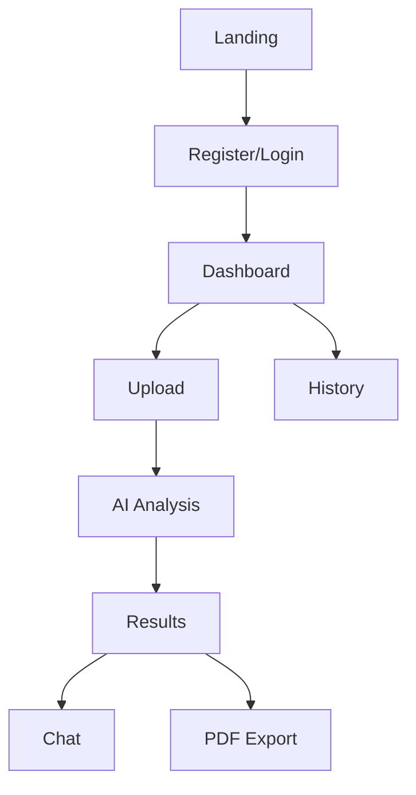

# Helloaca – AI Contract Analyzer
## Product Requirements Document (Updated)

## 1. Product Overview
Helloaca is an AI-powered contract analysis platform that helps founders, lawyers, procurement, contract managers, freelancers, vendors, buyers, and teams quickly understand contracts. Upload a contract and get instant insights into risks, obligations, protections, deadlines, and a plain‑language summary, with interactive Q&A.

## 2. Pricing & Plans
| Plan | Price | Limit | Key Capabilities |
|------|-------|-------|------------------|
| Free | $0/month | 1 analysis per month | Basic analysis summary |
| Pro | $3/month | Unlimited analyses | Full AI suite, risk detection, Chat with Contract, PDF export |
| Business (Roadmap) | TBD | Team features | Collaboration, white‑label exports |

## 3. Feature Modules
1. **Landing Page**: hero, “How helloaca works”, “Why helloaca”, “Where helloaca works best”, testimonials, pricing
2. **Dashboard**: contract history, upload widget, usage status
3. **Contract Analysis**: results overview with risks, obligations, protections, deadlines, summary
4. **Chat Interface**: interactive Q&A with citations to source sections
5. **Reports**: PDF export of findings and summaries
6. **Authentication**: login, register, forgot password
7. **Settings**: profile and plan management
8. **Documentation**: `/docs` GitBook‑like page with sticky sidebar, search, anchors

## 4. Page Details
| Page | Module | Description |
|------|--------|-------------|
| Landing | Hero | Value proposition, CTAs for Try Free and Subscribe $3/month |
| Landing | How helloaca works | Three cards: Upload & Scan, Instant AI Insights, Chat with Contract |
| Landing | Why helloaca | Four cards: Clarity without complexity, Instant risk detection, Control over decisions, Protection that’s always accessible |
| Landing | Where works best | Horizontal carousel of agreement types with scroll capture to force horizontal scrolling before page continues |
| Landing | Testimonials | Quotes with star ratings |
| Landing | Pricing | Single Pro plan at $3/month; clear feature bullets |
| Landing | Newsletter | Minimal email subscribe band before footer |
| Docs | GitBook‑like | Sticky sidebar with search, anchors, scroll‑spy; comprehensive product guide |
| Dashboard | Upload widget | Drag‑and‑drop PDF/DOCX; OCR for scanned PDFs |
| Analysis | Results | Risks, obligations, protections, deadlines, summary |
| Chat | Q&A | Ask targeted questions; answers with citations |
| Reports | Export | Download summaries and clause tables as PDF |

## 5. Core Processes
**Free Flow**
- Register → Upload one contract/month → View analysis summary.

**Pro Flow**
- Register → Subscribe → Upload unlimited contracts → View analysis → Chat → Export PDF.

## 6. Supported Agreements
NDAs, MSAs, SOWs, SaaS/subscription agreements, vendor/procurement contracts, licensing & IP, employment, independent contractor, lease & rental, partnership/joint venture, loan & financing, consulting, DPA, EULA, distribution, reseller, SLA.

## 7. SEO & Indexing
- **Canonical**: Set per route dynamically to `origin + pathname`; removes static canonical from `index.html` to avoid duplicates.
- **Robots Meta**: Public routes `index, follow`; protected routes `noindex, nofollow`.
- **Sitemap**: `https://helloaca.xyz/sitemap.xml` includes primary public pages (`/`, `/pricing`, `/about`, `/contact`, `/privacy`, `/terms`, `/login`, `/register`, `/forgot-password`, `/docs`).
- **Robots.txt**: `Sitemap: https://helloaca.xyz/sitemap.xml` for crawler discovery.
- **Open Graph**: `og:url` synced to canonical per route.

## 8. Analytics
- Google Analytics 4 Measurement ID: `G-0JVYR712V0`.
- Page views tracked on route changes.
- Event scaffolding for forms, navigation, pricing selections.

## 9. Architecture & Data
- Frontend: React + Vite + Tailwind.
- Storage & Auth: Supabase (`VITE_SUPABASE_URL`, `VITE_SUPABASE_ANON_KEY`).
- OCR & Parsing: PDF/DOCX supported; OCR for scanned PDFs.
- Exports: PDF reports with summaries and clause tables.

## 10. UX & Design Principles
- Typography: Inter (body), Space Grotesk (headings).
- Components: Rounded cards, light shadows, accessible contrast.
- Animations: IntersectionObserver‑based fade/slide; lightweight and performant.
- Carousel: Horizontal snap with arrow controls; scroll capture in section.

## 11. Security & Privacy
- Data encrypted in transit and at rest.
- Contracts stored in secure buckets; only owner can view.
- Permanent deletion available from dashboard.

## 12. Performance & Accessibility
- Avoid heavy libraries; use native APIs where possible.
- Keyboard and screen‑reader friendly controls.
- Responsive layout with mobile optimizations.

## 13. Roadmap
- Business plan: collaboration, white‑label exports.
- More agreement‑specific templates and checklists.
- Rich comparison view for negotiated versions.

## 14. Risks & Mitigations
- OCR quality variability → user guidance on scan quality.
- Misinterpretation risk → citations in Chat and explicit non‑legal‑advice messaging.

## 15. Glossary
- **MSA**: Master Service Agreement.
- **SOW**: Statement of Work.
- **DPA**: Data Processing Agreement.
- **SLA**: Service Level Agreement.
