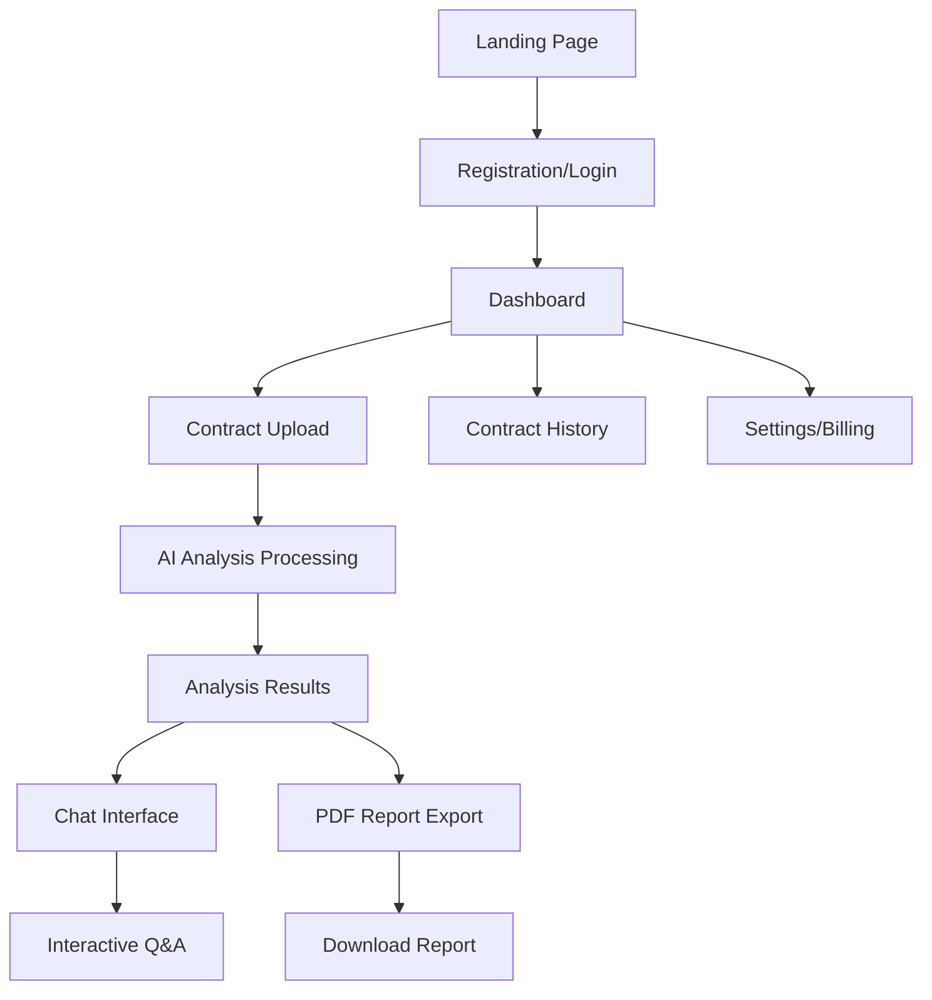

# HelloACA - AI Contract Analyzer
## Product Requirements Document

## 1. Product Overview
HelloACA is an AI-powered contract analysis platform that helps small law firms, real estate agents, and business owners detect contract risks, clauses, and obligations within 30 seconds. The platform leverages advanced AI technology to provide instant contract insights, risk assessment, and interactive contract consultation through an intuitive web interface.

The product addresses the critical need for fast, accurate contract analysis in professional environments where legal expertise may be limited but contract understanding is essential for business decisions.

## 2. Core Features

### 2.1 User Roles
| Role | Registration Method | Core Permissions |
|------|---------------------|------------------|
| Free User | Email registration | 1 contract analysis per month, basic clause detection |
| Pro User | Paid subscription ($49/month) | 10 contracts per month, AI chat, risk classification, PDF reports |
| Business User | Enterprise subscription ($299/month) | Unlimited contracts, team collaboration, multilingual analysis, white-label reports |

### 2.2 Feature Module
Our HelloACA platform consists of the following main pages:
1. **Landing Page**: hero section with value proposition, feature showcase, testimonials, and pricing overview
2. **Dashboard**: contract history, upload interface, usage statistics, plan management
3. **Contract Analysis Page**: file upload, AI analysis results, risk assessment display
4. **Chat Interface**: interactive contract consultation, PDF preview, message history
5. **Reports Page**: generated PDF reports, download history, export options
6. **Authentication Pages**: login, registration, password recovery
7. **Settings Page**: profile management, subscription details, team collaboration settings

### 2.3 Page Details
| Page Name | Module Name | Feature description |
|-----------|-------------|---------------------|
| Landing Page | Hero Section | Display compelling value proposition with "Try for Free" and "See Demo" CTAs |
| Landing Page | Feature Grid | Showcase three core features: Upload & Scan, Instant AI Insights, Chat with Contract |
| Landing Page | Testimonials | Display customer success stories from real estate agents and law firms |
| Landing Page | Pricing Section | Present three-tier pricing model with feature comparisons |
| Dashboard | Contract History | List previously analyzed contracts with search and filter capabilities |
| Dashboard | Upload Widget | Drag-and-drop file upload for PDF and DOCX contracts |
| Dashboard | Usage Statistics | Display current plan usage and upgrade prompts |
| Contract Analysis | File Processing | Handle PDF/DOCX upload with OCR for image-based documents |
| Contract Analysis | AI Analysis Display | Show structured clause extraction, risk levels, and recommendations |
| Contract Analysis | Risk Assessment | Categorize and highlight contract risks with severity indicators |
| Chat Interface | Contract Preview | Display uploaded contract with synchronized highlighting |
| Chat Interface | AI Chat Window | Interactive Q&A about contract details with context-aware responses |
| Chat Interface | Message History | Store and display previous chat conversations per contract |
| Reports Page | PDF Generation | Create branded PDF reports with analysis findings and recommendations |
| Reports Page | Download Management | Track and provide access to previously generated reports |
| Authentication | Login/Register | Email-based authentication with OAuth integration options |
| Settings | Profile Management | User account details, password changes, notification preferences |
| Settings | Subscription Management | Plan upgrades, billing history, payment method updates |

## 3. Core Process

**Free User Flow:**
Users register with email, upload one contract per month, receive basic clause analysis, and view results on the platform without PDF export capability.

**Pro User Flow:**
Subscribers upload contracts (up to 10/month), receive comprehensive AI analysis with risk classification, interact with contracts through AI chat, and export detailed PDF reports.

**Business User Flow:**
Enterprise users enjoy unlimited contract uploads, team collaboration features, multilingual analysis capabilities, and white-label report generation for client distribution.

## 4. User Interface Design

### 4.1 Design Style
- **Primary Color**: #4ECCA3 (vibrant teal for CTAs and highlights)
- **Secondary Color**: #000000 (black for text and contrast elements)
- **Background Color**: #FFFFFF (clean white background)
- **Button Style**: Rounded corners (12px border radius) with hover animations
- **Typography**: Inter (primary font, weights 400-700), Space Grotesk (secondary, for headings)
- **Layout Style**: Card-based design with 20px border radius and subtle shadows
- **Logo Style**: Minimal wordmark with AI-inspired letter A and integrated balance-scale icon
- **Icons**: Modern, minimal line icons with consistent stroke width

### 4.2 Page Design Overview
| Page Name | Module Name | UI Elements |
|-----------|-------------|-------------|
| Landing Page | Hero Section | Large typography (Space Grotesk 700), primary CTA button (#4ECCA3), clean white background |
| Landing Page | Feature Grid | Three-column card layout, subtle shadows (0px 6px 18px rgba(0,0,0,0.06)), 24px padding |
| Dashboard | Upload Widget | Drag-and-drop zone with dashed border, file type indicators, progress animations |
| Contract Analysis | Results Display | Structured data cards, color-coded risk levels (red/yellow/green), expandable sections |
| Chat Interface | Split Layout | Left panel for PDF preview, right panel for chat with #4ECCA3 accent colors |
| Reports Page | Report Cards | Grid layout with download buttons, file size indicators, creation timestamps |

### 4.3 Responsiveness
The platform is desktop-first with mobile-adaptive design. Touch interaction optimization is implemented for mobile users, with responsive breakpoints at 768px (tablet) and 480px (mobile). The chat interface adapts to single-column layout on mobile devices.
