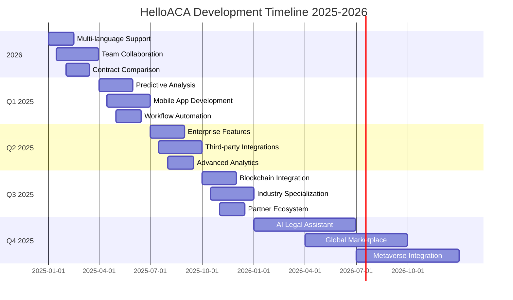

# HelloACA Product Roadmap
## AI-Powered Contract Analysis Platform

---

## Table of Contents
1. [Current Features (v1.0)](#current-features-v10)
2. [Planned Enhancements](#planned-enhancements)
3. [Version History](#version-history)
4. [Development Timeline](#development-timeline)
5. [Feature Requests & Feedback](#feature-requests--feedback)

---

## Current Features (v1.0)

### ✅ Core Platform Features

#### User Authentication & Management
- **Email Registration & Login**: Secure user account creation and authentication
- **Password Recovery**: Forgot password functionality with email reset
- **User Profiles**: Basic profile management and settings
- **Subscription Management**: Plan upgrades, billing, and usage tracking

#### Contract Analysis Engine
- **File Upload Support**: PDF and DOCX file processing (up to 10MB)
- **OCR Technology**: Scanned document text extraction
- **Claude AI Integration**: Advanced contract analysis using Anthropic's Claude AI
- **Risk Assessment**: Automated risk level classification (High/Medium/Low)
- **Clause Extraction**: Key contract element identification and highlighting
- **Processing Speed**: 30-second average analysis time

#### Interactive Features
- **AI Chat Interface**: Natural language contract consultation
- **Contract Preview**: Side-by-side document viewing with analysis
- **Message History**: Persistent chat conversations per contract
- **Context-Aware Responses**: AI understands contract-specific context

#### Dashboard & Management
- **Contract History**: Complete analysis history with search and filtering
- **Usage Statistics**: Plan usage tracking and upgrade prompts
- **Drag & Drop Upload**: Intuitive file upload interface
- **Quick Re-analysis**: One-click contract re-processing

#### Reporting & Export
- **PDF Report Generation**: Professional analysis reports (Pro/Business plans)
- **Download Management**: Report history and access control
- **Structured Analysis Display**: Organized results presentation
- **Risk Visualization**: Color-coded risk indicators

#### Subscription Tiers
- **Free Plan**: 1 contract/month, basic analysis
- **Pro Plan ($49/month)**: 10 contracts/month, AI chat, PDF reports
- **Business Plan ($299/month)**: Unlimited contracts, team features

### 🏗️ Technical Infrastructure

#### Frontend Architecture
- **React 18**: Modern component-based UI framework
- **TypeScript**: Type-safe development environment
- **Vite**: Fast build tool and development server
- **TailwindCSS**: Utility-first CSS framework
- **Responsive Design**: Mobile and tablet optimized interface

#### Backend & Services
- **Supabase**: Backend-as-a-Service with PostgreSQL database
- **Authentication**: Supabase Auth with email/password
- **File Storage**: Secure contract document storage
- **Real-time Features**: Live chat and status updates

#### AI & Processing
- **Claude AI API**: Anthropic's advanced language model
- **PDF Processing**: Text extraction and OCR capabilities
- **Natural Language Processing**: Contract understanding and analysis
- **Risk Classification**: Automated risk assessment algorithms

---

## Planned Enhancements

### 🚀 Q1 2025 - Enhanced Analysis & Collaboration

#### Advanced Analysis Features
- **Multi-language Support**: Contract analysis in Spanish, French, German
- **Contract Comparison**: Side-by-side contract comparison tool
- **Template Library**: Pre-built contract templates and clauses
- **Custom Risk Profiles**: Industry-specific risk assessment criteria
- **Batch Processing**: Multiple contract analysis in single upload

#### Team Collaboration (Business Plan)
- **Team Workspaces**: Shared contract libraries and analysis
- **Role-based Permissions**: Admin, Editor, Viewer access levels
- **Comment System**: Collaborative contract review and annotations
- **Approval Workflows**: Multi-step contract approval processes
- **Team Analytics**: Usage statistics and performance metrics

#### Enhanced Reporting
- **Custom Report Templates**: Branded report customization
- **Executive Dashboards**: High-level contract portfolio insights
- **Automated Alerts**: Risk-based notification system
- **Integration Reports**: Export to popular business tools

### 🎯 Q2 2025 - AI Intelligence & Automation

#### Advanced AI Capabilities
- **Predictive Analysis**: Contract outcome prediction based on historical data
- **Negotiation Suggestions**: AI-powered contract improvement recommendations
- **Clause Optimization**: Automated clause enhancement suggestions
- **Legal Precedent Integration**: Reference to relevant case law and regulations
- **Smart Redlining**: Automated contract markup and revision suggestions

#### Workflow Automation
- **Contract Lifecycle Management**: End-to-end contract process automation
- **Renewal Reminders**: Automated contract expiration notifications
- **Compliance Monitoring**: Ongoing regulatory compliance checking
- **Integration APIs**: Connect with CRM, ERP, and legal management systems
- **Webhook Support**: Real-time notifications for external systems

#### Enhanced User Experience
- **Mobile App**: Native iOS and Android applications
- **Offline Analysis**: Limited offline contract review capabilities
- **Voice Commands**: Voice-activated contract queries
- **Smart Search**: Advanced contract search with natural language
- **Personalized Insights**: User-specific analysis patterns and recommendations

### 🌟 Q3 2025 - Enterprise & Integration

#### Enterprise Features
- **Single Sign-On (SSO)**: SAML and OAuth enterprise authentication
- **Advanced Security**: SOC 2 Type II compliance and audit trails
- **Data Residency**: Regional data storage options
- **Custom Deployment**: On-premise and private cloud options
- **White-label Solution**: Fully branded platform for resellers

#### Third-party Integrations
- **Legal Management Systems**: Integration with Clio, MyCase, PracticePanther
- **Document Management**: SharePoint, Google Drive, Dropbox sync
- **CRM Integration**: Salesforce, HubSpot, Pipedrive connectivity
- **E-signature Platforms**: DocuSign, Adobe Sign, HelloSign integration
- **Accounting Software**: QuickBooks, Xero financial data sync

#### Advanced Analytics
- **Business Intelligence**: Comprehensive contract analytics and insights
- **Risk Trending**: Historical risk analysis and pattern recognition
- **Performance Metrics**: Contract success rate and outcome tracking
- **Benchmarking**: Industry comparison and best practice recommendations
- **Predictive Modeling**: Contract performance and risk forecasting

### 🔮 Q4 2025 - Innovation & Expansion

#### Emerging Technologies
- **Blockchain Integration**: Smart contract analysis and validation
- **Machine Learning Enhancement**: Continuously improving analysis accuracy
- **Natural Language Generation**: Automated contract drafting assistance
- **Computer Vision**: Enhanced document processing and layout understanding
- **Augmented Reality**: AR-powered contract review for mobile devices

#### Market Expansion
- **Industry Specialization**: Tailored solutions for healthcare, real estate, finance
- **Regional Compliance**: Local legal requirement integration by jurisdiction
- **Educational Resources**: Built-in legal education and training modules
- **Certification Programs**: Professional contract analysis certification
- **Partner Ecosystem**: Integration marketplace and developer platform

### 🌐 2026 & Beyond - Long-term Vision

#### Advanced AI & Automation
- **Fully Autonomous Contract Generation**: AI creates complete contracts from requirements
- **Legal AI Assistant**: 24/7 AI legal counsel for contract questions
- **Predictive Legal Analytics**: Forecast contract outcomes and legal trends
- **Cross-jurisdictional Analysis**: Global legal compliance and comparison
- **Real-time Legal Updates**: Automatic contract updates based on law changes

#### Platform Evolution
- **Metaverse Integration**: Virtual reality contract negotiation spaces
- **Global Marketplace**: Contract template and service marketplace
- **AI Legal Education**: Comprehensive legal training platform
- **Regulatory Technology**: Automated compliance and regulatory reporting
- **Legal Innovation Lab**: R&D platform for legal technology advancement

---

## Version History

### Version 1.1.0 (Q4 2025) - Current Release ✅
**🎉 Current Features**
- Core contract analysis engine with Claude AI
- User authentication and subscription management
- Interactive chat interface for contract consultation
- PDF report generation for Pro and Business users
- Responsive web application with modern UI
- Supabase backend infrastructure
- Dashboard and contract history with usage statistics
- Team collaboration: dynamic list shows owner, active members, and pending invites until acceptance
- Public domain references updated to `https://preview.helloaca.xyz` across app, emails, and exports
- CORS-preflight-enabled notify endpoint for emails and digest communications
- Mixpanel identity merge on sign-in to associate anonymous activity with user profiles

**📊 Current Metrics**
- Support for PDF and DOCX files up to 10MB
- 30-second average analysis time (typical)
- 3-tier subscription model
- Mobile-responsive design
- Enterprise-grade security
- Email delivery via Resend when configured

### Version 0.9.0 (Q3 2024) - Beta Release
**🧪 Beta Testing Phase**
- Limited user testing with select legal professionals
- Core analysis engine development and testing
- UI/UX refinement based on user feedback
- Performance optimization and bug fixes
- Security audit and compliance review

**🔧 Technical Improvements**
- TypeScript migration for better code quality
- Comprehensive error handling and logging
- Automated testing suite implementation
- CI/CD pipeline setup with Vercel
- Database schema optimization

### Version 0.5.0 (October 2024) - Alpha Release
**🚧 Development Milestone**
- Initial Claude AI integration
- Basic contract upload and processing
- Prototype user interface
- Core authentication system
- Database schema design

**🎯 Alpha Goals Achieved**
- Proof of concept validation
- Technical architecture establishment
- Initial user feedback collection
- Performance baseline establishment
- Security framework implementation

---

## Development Timeline

### 🗓️ 2025-2026 Roadmap Overview

### 📅 Quarterly Milestones

#### Q1 2025 Objectives
- **Primary Goal**: Enhanced collaboration and multi-language support
- **Key Deliverables**: Team workspaces, Spanish/French/German analysis
- **Success Metrics**: 50% increase in Business plan adoption
- **User Impact**: Expanded market reach and team productivity

#### Q2 2025 Objectives
- **Primary Goal**: AI intelligence and mobile accessibility
- **Key Deliverables**: Predictive analysis, native mobile apps
- **Success Metrics**: 40% improvement in analysis accuracy
- **User Impact**: Proactive contract insights and mobile workflow

#### Q3 2025 Objectives
- **Primary Goal**: Enterprise readiness and ecosystem integration
- **Key Deliverables**: SSO, third-party integrations, advanced analytics
- **Success Metrics**: 10+ enterprise customers, 5+ integration partners
- **User Impact**: Seamless workflow integration and enterprise security

#### Q4 2025 Objectives
- **Primary Goal**: Innovation leadership and market expansion
- **Key Deliverables**: Blockchain features, industry specialization
- **Success Metrics**: Market leadership position, 100K+ users
- **User Impact**: Cutting-edge technology and specialized solutions

---

## Feature Requests & Feedback

### 🎯 Community-Driven Development

We believe in building HelloACA with our users. Your feedback drives our roadmap priorities and feature development.

#### How to Submit Feature Requests
1. **In-App Feedback**: Use the feedback widget in your dashboard
2. **Email Requests**: Send detailed requests to product@helloaca.xyz
3. **Community Forum**: Join discussions at community.helloaca.xyz
4. **User Interviews**: Participate in monthly user research sessions

#### Current Top Requests
1. **Contract Templates** (47 votes) - Pre-built contract templates library
2. **Bulk Upload** (34 votes) - Multiple file upload and batch processing
3. **API Access** (28 votes) - Developer API for custom integrations
4. **Advanced Search** (25 votes) - Cross-contract search and filtering
5. **Mobile App** (23 votes) - Native mobile applications

#### Feature Voting System
- **Vote on Features**: Prioritize development based on user demand
- **Feature Status**: Track progress from idea to implementation
- **Release Updates**: Get notified when requested features are released
- **Beta Access**: Early access to new features for active community members

### 📈 Success Metrics & KPIs

#### User Engagement Metrics
- **Monthly Active Users**: Target 50K by end of 2025
- **Contract Analysis Volume**: 100K+ contracts analyzed monthly
- **User Retention**: 85% monthly retention rate for paid users
- **Feature Adoption**: 70% of users engage with chat interface

#### Business Growth Metrics
- **Revenue Growth**: 300% year-over-year growth target
- **Customer Acquisition**: 1,000 new paid subscribers monthly
- **Enterprise Adoption**: 100+ enterprise customers by Q4 2025
- **Market Expansion**: Launch in 3 additional countries

#### Product Quality Metrics
- **Analysis Accuracy**: 95%+ accuracy rate for risk assessment
- **Performance**: Sub-30 second analysis time maintained
- **Uptime**: 99.9% platform availability
- **Customer Satisfaction**: 4.8+ star rating across all platforms

### 🤝 Partnership & Integration Roadmap

#### Strategic Partnerships
- **Legal Technology Vendors**: Integration partnerships with major legal tech companies
- **Professional Associations**: Partnerships with bar associations and legal organizations
- **Educational Institutions**: Law school partnerships for student access and training
- **Industry Associations**: Real estate, business, and professional service partnerships

#### Integration Priorities
1. **Legal Management Systems**: Clio, MyCase, PracticePanther (Q2 2025)
2. **Document Platforms**: SharePoint, Google Workspace, Box (Q2 2025)
3. **CRM Systems**: Salesforce, HubSpot, Pipedrive (Q3 2025)
4. **E-signature Tools**: DocuSign, Adobe Sign, HelloSign (Q3 2025)
5. **Accounting Software**: QuickBooks, Xero, FreshBooks (Q4 2025)

---

## Contact & Feedback

**Product Team**: product@helloaca.xyz
**Feature Requests**: features@helloaca.xyz
**Community Forum**: community.helloaca.xyz
**Developer Resources**: developers.helloaca.xyz

---

*This roadmap is subject to change based on user feedback, market conditions, and technical considerations. Last updated: Q4 2024*
