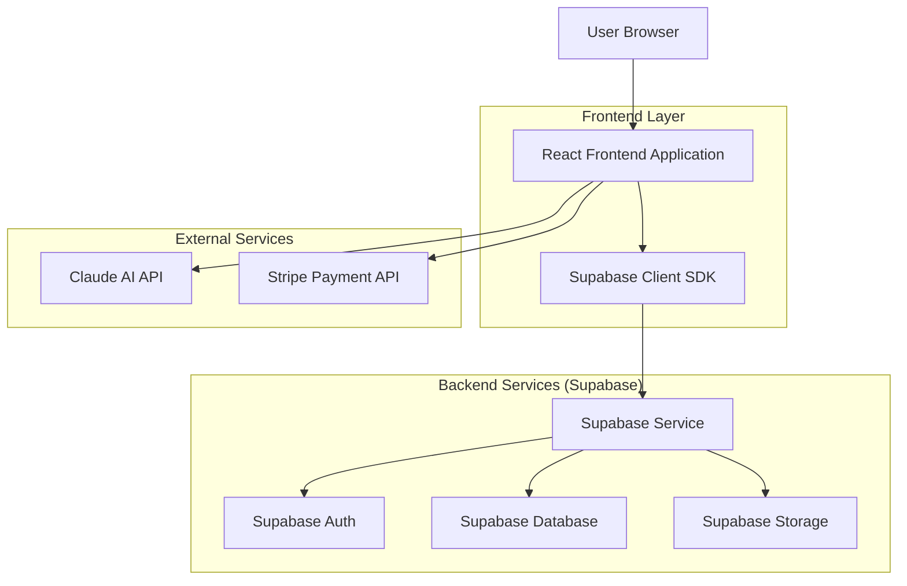
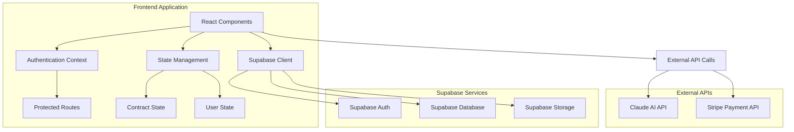
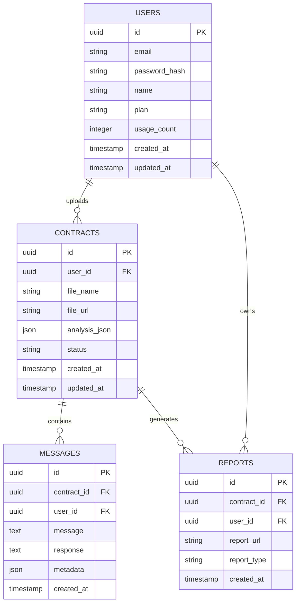

# HelloACA - AI Contract Analyzer

## Technical Architecture Document

## 1. Architecture Design



## 2. Technology Description

* Frontend: React\@18 + TailwindCSS\@3 + TypeScript\@5 + Vite

* Backend: Supabase (Backend-as-a-Service)

* Database: Supabase PostgreSQL\@15

* Authentication: Supabase Auth (Email/Password + Social Login)

* File Storage: Supabase Storage

* AI Engine: Claude AI API (Client-side integration)

* Payment: Stripe API (Client-side integration)

* Deployment: Vercel (frontend), Supabase (backend services)

## 3. Route Definitions

| Route                  | Purpose                                                   |
| ---------------------- | --------------------------------------------------------- |
| /                      | Landing page with hero section, features, and pricing     |
| /dashboard             | User dashboard with contract history and upload interface |
| /analyze/\[contractId] | Contract analysis results and AI insights display         |
| /chat/\[contractId]    | Interactive chat interface with contract preview          |
| /reports               | PDF report generation and download management             |
| /settings              | User profile, subscription, and team management           |
| /auth/login            | User authentication and login                             |
| /auth/register         | New user registration                                     |
| /auth/forgot-password  | Password recovery flow                                    |

## 4. Supabase Integration

### 4.1 Authentication System

**User Registration**

```typescript
// Supabase Auth - Email/Password Registration
const { data, error } = await supabase.auth.signUp({
  email: 'user@example.com',
  password: 'password123',
  options: {
    data: {
      name: 'John Doe',
      plan: 'free'
    }
  }
})
```

**User Login**

```typescript
// Supabase Auth - Email/Password Login
const { data, error } = await supabase.auth.signInWithPassword({
  email: 'user@example.com',
  password: 'password123'
})
```

**Session Management**

```typescript
// Get current user session
const { data: { session } } = await supabase.auth.getSession()

// Listen for auth changes
supabase.auth.onAuthStateChange((event, session) => {
  if (event === 'SIGNED_IN') console.log('User signed in')
  if (event === 'SIGNED_OUT') console.log('User signed out')
})
```

### 4.2 Database Operations

**Contract Upload**

```typescript
// Upload file to Supabase Storage
const { data: fileData, error: uploadError } = await supabase.storage
  .from('contracts')
  .upload(`${userId}/${fileName}`, file)

// Insert contract record
const { data, error } = await supabase
  .from('contracts')
  .insert({
    user_id: userId,
    file_name: fileName,
    file_url: fileData.path,
    status: 'uploaded'
  })
```

**Contract Analysis Storage**

```typescript
// Update contract with analysis results
const { data, error } = await supabase
  .from('contracts')
  .update({
    analysis_json: analysisResults,
    status: 'analyzed'
  })
  .eq('id', contractId)
```

**Chat Messages**

```typescript
// Insert chat message
const { data, error } = await supabase
  .from('messages')
  .insert({
    contract_id: contractId,
    user_id: userId,
    message: userMessage,
    response: aiResponse,
    metadata: { confidence: 0.95 }
  })
```

**Real-time Subscriptions**

```typescript
// Subscribe to contract analysis updates
const subscription = supabase
  .channel('contract-updates')
  .on('postgres_changes', {
    event: 'UPDATE',
    schema: 'public',
    table: 'contracts',
    filter: `user_id=eq.${userId}`
  }, (payload) => {
    console.log('Contract updated:', payload)
  })
  .subscribe()
```

## 5. Client-Side Architecture



## 6. Data Model

### 6.1 Data Model Definition



### 6.2 Supabase Database Setup

**User Profiles Table (extends Supabase Auth)**

```sql
-- Create user profiles table (Supabase Auth handles core user data)
CREATE TABLE user_profiles (
    id UUID PRIMARY KEY REFERENCES auth.users(id) ON DELETE CASCADE,
    name VARCHAR(100) NOT NULL,
    plan VARCHAR(20) DEFAULT 'free' CHECK (plan IN ('free', 'pro', 'business')),
    usage_count INTEGER DEFAULT 0,
    created_at TIMESTAMP WITH TIME ZONE DEFAULT NOW(),
    updated_at TIMESTAMP WITH TIME ZONE DEFAULT NOW()
);

-- Create indexes
CREATE INDEX idx_user_profiles_plan ON user_profiles(plan);

-- Enable Row Level Security
ALTER TABLE user_profiles ENABLE ROW LEVEL SECURITY;

-- Create RLS policies
CREATE POLICY "Users can view own profile" ON user_profiles
    FOR SELECT USING (auth.uid() = id);

CREATE POLICY "Users can update own profile" ON user_profiles
    FOR UPDATE USING (auth.uid() = id);

-- Grant permissions
GRANT SELECT, INSERT, UPDATE ON user_profiles TO authenticated;
```

**Contracts Table**

```sql
-- Create contracts table
CREATE TABLE contracts (
    id UUID PRIMARY KEY DEFAULT gen_random_uuid(),
    user_id UUID NOT NULL REFERENCES auth.users(id) ON DELETE CASCADE,
    file_name VARCHAR(255) NOT NULL,
    file_url TEXT NOT NULL,
    analysis_json JSONB,
    status VARCHAR(50) DEFAULT 'uploaded' CHECK (status IN ('uploaded', 'processing', 'analyzed', 'error')),
    created_at TIMESTAMP WITH TIME ZONE DEFAULT NOW(),
    updated_at TIMESTAMP WITH TIME ZONE DEFAULT NOW()
);

-- Create indexes
CREATE INDEX idx_contracts_user_id ON contracts(user_id);
CREATE INDEX idx_contracts_status ON contracts(status);
CREATE INDEX idx_contracts_created_at ON contracts(created_at DESC);

-- Enable Row Level Security
ALTER TABLE contracts ENABLE ROW LEVEL SECURITY;

-- Create RLS policies
CREATE POLICY "Users can view own contracts" ON contracts
    FOR SELECT USING (auth.uid() = user_id);

CREATE POLICY "Users can insert own contracts" ON contracts
    FOR INSERT WITH CHECK (auth.uid() = user_id);

CREATE POLICY "Users can update own contracts" ON contracts
    FOR UPDATE USING (auth.uid() = user_id);

-- Grant permissions
GRANT SELECT, INSERT, UPDATE, DELETE ON contracts TO authenticated;
```

**Messages Table**

```sql
-- Create messages table
CREATE TABLE messages (
    id UUID PRIMARY KEY DEFAULT gen_random_uuid(),
    contract_id UUID NOT NULL REFERENCES contracts(id) ON DELETE CASCADE,
    user_id UUID NOT NULL REFERENCES auth.users(id) ON DELETE CASCADE,
    message TEXT NOT NULL,
    response TEXT NOT NULL,
    metadata JSONB DEFAULT '{}',
    created_at TIMESTAMP WITH TIME ZONE DEFAULT NOW()
);

-- Create indexes
CREATE INDEX idx_messages_contract_id ON messages(contract_id);
CREATE INDEX idx_messages_user_id ON messages(user_id);
CREATE INDEX idx_messages_created_at ON messages(created_at DESC);

-- Enable Row Level Security
ALTER TABLE messages ENABLE ROW LEVEL SECURITY;

-- Create RLS policies
CREATE POLICY "Users can view own messages" ON messages
    FOR SELECT USING (auth.uid() = user_id);

CREATE POLICY "Users can insert own messages" ON messages
    FOR INSERT WITH CHECK (auth.uid() = user_id);

-- Grant permissions
GRANT SELECT, INSERT ON messages TO authenticated;
```

**Reports Table**

```sql
-- Create reports table
CREATE TABLE reports (
    id UUID PRIMARY KEY DEFAULT gen_random_uuid(),
    contract_id UUID NOT NULL REFERENCES contracts(id) ON DELETE CASCADE,
    user_id UUID NOT NULL REFERENCES auth.users(id) ON DELETE CASCADE,
    report_url TEXT NOT NULL,
    report_type VARCHAR(50) DEFAULT 'standard' CHECK (report_type IN ('standard', 'white-label')),
    created_at TIMESTAMP WITH TIME ZONE DEFAULT NOW()
);

-- Create indexes
CREATE INDEX idx_reports_contract_id ON reports(contract_id);
CREATE INDEX idx_reports_user_id ON reports(user_id);
CREATE INDEX idx_reports_created_at ON reports(created_at DESC);

-- Enable Row Level Security
ALTER TABLE reports ENABLE ROW LEVEL SECURITY;

-- Create RLS policies
CREATE POLICY "Users can view own reports" ON reports
    FOR SELECT USING (auth.uid() = user_id);

CREATE POLICY "Users can insert own reports" ON reports
    FOR INSERT WITH CHECK (auth.uid() = user_id);

-- Grant permissions
GRANT SELECT, INSERT ON reports TO authenticated;
```

**Storage Buckets Setup**

```sql
-- Create storage bucket for contract files
INSERT INTO storage.buckets (id, name, public) VALUES ('contracts', 'contracts', false);

-- Create storage policies
CREATE POLICY "Users can upload own contracts" ON storage.objects
    FOR INSERT WITH CHECK (bucket_id = 'contracts' AND auth.uid()::text = (storage.foldername(name))[1]);

CREATE POLICY "Users can view own contracts" ON storage.objects
    FOR SELECT USING (bucket_id = 'contracts' AND auth.uid()::text = (storage.foldername(name))[1]);

CREATE POLICY "Users can delete own contracts" ON storage.objects
    FOR DELETE USING (bucket_id = 'contracts' AND auth.uid()::text = (storage.foldername(name))[1]);
```

