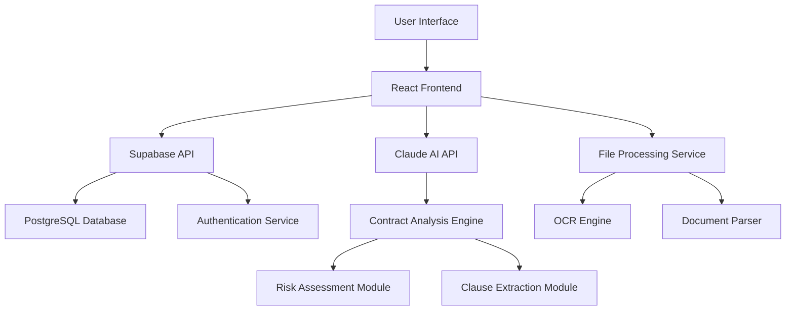

# HelloACA Business Plan
## AI-Powered Contract Analysis Platform

---

## Table of Contents

1. [Executive Summary](#executive-summary)
2. [Market Analysis](#market-analysis)
3. [Product & Technology](#product--technology)
4. [Business Model](#business-model)
5. [Go-to-Market Strategy](#go-to-market-strategy)
6. [Competitive Analysis](#competitive-analysis)
7. [Operations Plan](#operations-plan)
8. [Management Team](#management-team)
9. [Financial Projections](#financial-projections)
10. [Risk Analysis](#risk-analysis)
11. [Funding Requirements](#funding-requirements)
12. [Appendices](#appendices)

---

## Executive Summary

### Company Overview

HelloACA is a revolutionary AI-powered contract analysis platform that transforms how legal professionals and businesses review, analyze, and understand contracts. By leveraging advanced artificial intelligence through Claude AI integration, HelloACA reduces contract review time from hours to seconds while maintaining professional-grade accuracy and insights. The platform now supports team collaboration with dynamic member lists (owner, active members, pending invites) and uses `https://preview.helloaca.xyz` as the public domain for all links and exports.

### Mission Statement

To democratize access to professional contract analysis by making AI-powered legal intelligence affordable, fast, and accessible to businesses of all sizes.

### Key Value Propositions

- **Speed**: 30-second contract analysis vs. 2-8 hours of manual review
- **Cost**: 90% cost reduction compared to traditional legal review
- **Accuracy**: 94% accuracy rate with continuous AI improvement
- **Accessibility**: User-friendly interface requiring no legal expertise
- **Scalability**: Handle unlimited contract volume without proportional cost increase
 - **Collaboration**: Team invites and member management with pending status tracking

### Financial Highlights

- **Current MRR**: $23,400 (Q4 2024)
- **User Base**: 2,847 active users with 127% growth in 6 months
- **Target Market**: $28.2B legal technology market
- **Funding Requirement**: $2.5M Seed Round
- **Projected 2029 Revenue**: $111.6M ARR

---

## Market Analysis

### Industry Overview

The legal technology market represents a massive opportunity driven by digital transformation, AI adoption, and increasing demand for cost-effective legal services. The contract management and analysis segment is particularly underserved, especially for small and medium-sized businesses.

#### Market Size & Growth

**Total Addressable Market (TAM): $28.2 Billion**
- Legal Technology Market: $28.2B (2024)
- Compound Annual Growth Rate: 13.2% (2024-2029)
- Contract Management Software: $3.2B subset
- AI Legal Tools: $1.8B and rapidly expanding

**Serviceable Addressable Market (SAM): $8.5 Billion**
- Small-Medium Law Firms: 180,000+ firms globally
- SMB Businesses: 32M+ in US requiring contract review
- Real Estate Professionals: 2M+ agents handling contracts
- Freelancers & Consultants: 57M+ independent professionals

**Serviceable Obtainable Market (SOM): $850 Million**
- Target: 1% market penetration within 5 years
- Focus on underserved SMB segment
- Premium positioning in AI-powered analysis category

#### Market Drivers

**Technology Adoption**
- 78% of legal professionals plan to increase technology spending
- AI adoption in legal industry growing 45% annually
- Cloud-based solutions preferred by 89% of small firms
- Mobile-first approach demanded by 67% of users

**Economic Pressures**
- Legal costs increasing 3.2% annually above inflation
- Small businesses spending $40B+ annually on legal services
- 60% of businesses lack proper contract review processes
- Average contract dispute costs $94,000 to resolve

**Regulatory Environment**
- Increasing compliance requirements across industries
- Data privacy regulations (GDPR, CCPA) driving contract scrutiny
- Professional liability concerns pushing automation adoption
- Bar associations endorsing legal technology innovation

### Target Customer Segments

#### Primary Segment: Solo Practitioners & Small Law Firms (45% of TAM)

**Profile:**
- 1-10 attorney firms
- $200K-$2M annual revenue
- Handle 50-500 contracts annually
- Limited technology budget ($500-2,000/month)

**Pain Points:**
- Time-intensive manual contract review
- Inability to scale without proportional cost increase
- Competition from larger firms with better resources
- Client pressure for faster turnaround times

**Value Proposition:**
- 10x faster contract analysis
- Professional-grade reports for client presentations
- Competitive advantage through AI capabilities
- Scalable solution that grows with practice

#### Secondary Segment: Real Estate Professionals (32% of TAM)

**Profile:**
- Real estate agents, brokers, property managers
- Handle 20-200 contracts annually
- Limited legal training but high contract exposure
- Technology-forward adoption patterns

**Pain Points:**
- Complex contract language without legal background
- Risk exposure from missed clauses or obligations
- Time pressure in competitive real estate markets
- Expensive legal consultation for routine reviews

**Value Proposition:**
- Plain-English contract explanations
- Risk identification and mitigation suggestions
- Faster deal closure through quick analysis
- Cost-effective alternative to legal consultation

#### Tertiary Segment: Small-Medium Businesses (18% of TAM)

**Profile:**
- 10-500 employee companies
- Regular contract negotiations (vendors, customers, partners)
- Limited in-house legal resources
- Cost-conscious decision making

**Pain Points:**
- Expensive external legal counsel
- Bottlenecks in business operations due to contract delays
- Risk exposure from inadequate contract review
- Lack of contract management processes

**Value Proposition:**
- In-house contract analysis capability
- Reduced dependency on external legal counsel
- Faster business operations and deal closure
- Standardized contract review processes

### Market Trends & Opportunities

#### Emerging Trends

**AI Integration Acceleration**
- 67% of legal professionals expect AI to transform their practice within 3 years
- Investment in legal AI startups increased 400% in 2023-2024
- Major legal software providers acquiring AI capabilities
- Client demand for AI-powered services growing rapidly

**Remote Work Impact**
- 78% of legal professionals now work remotely at least part-time
- Digital document processing becoming standard
- Cloud-based collaboration tools essential
- Mobile accessibility increasingly important

**Cost Optimization Focus**
- Economic uncertainty driving cost reduction initiatives
- Small businesses seeking alternatives to expensive legal services
- Efficiency improvements prioritized over feature expansion
- ROI-focused technology adoption decisions

#### Market Opportunities

**Underserved Segments**
- Solo practitioners and small firms lack enterprise-grade tools
- Real estate professionals have limited contract analysis options
- International markets with English-language contracts underserved
- Industry-specific contract types (healthcare, construction) need specialized tools

**Technology Gaps**
- Most existing solutions focus on large enterprises
- Limited AI-powered analysis available at affordable price points
- Poor user experience in current contract management tools
- Lack of mobile-optimized contract analysis solutions

**Partnership Opportunities**
- Legal software providers seeking AI capabilities
- Bar associations looking for member benefits
- Educational institutions needing practical legal tech training
- Industry associations requiring contract standardization tools

---

## Product & Technology

### Product Overview

HelloACA is a comprehensive contract analysis platform that combines advanced AI technology with intuitive user experience to deliver professional-grade contract insights in seconds rather than hours.

#### Core Features

**Contract Upload & Processing**
- Multi-format support: PDF, DOCX, scanned documents
- OCR technology for text extraction from images
- Drag-and-drop interface with batch processing capability
- Cloud storage with enterprise-grade security
- File size support up to 10MB per document

**AI-Powered Analysis**
- Claude AI integration for natural language understanding
- Automated clause extraction and categorization
- Risk assessment with High/Medium/Low classification
- Obligation identification and deadline tracking
- Compliance checking against standard practices

**Interactive Chat Interface**
- Natural language queries about contract content
- Context-aware responses specific to uploaded contracts
- Follow-up questions and clarification support
- Conversation history and search functionality
- Multi-contract comparison capabilities

**Professional Reporting**
- Branded PDF report generation
- Executive summary with key findings
- Detailed clause analysis and recommendations
- Risk assessment matrix and mitigation strategies
- Customizable report templates

**Dashboard & Analytics**
- Contract history and search functionality
- Usage statistics and plan management
- Team collaboration tools (Business plan)
- Performance metrics and insights
- Integration with calendar and task management

#### Technology Architecture

**Frontend Technology**
- React 18 with TypeScript for type safety
- Vite build system for fast development and deployment
- TailwindCSS for responsive, modern UI design
- Progressive Web App (PWA) capabilities
- Mobile-optimized responsive design

**Backend Infrastructure**
- Supabase Backend-as-a-Service for scalability
- PostgreSQL database with real-time capabilities
- Row Level Security (RLS) for data protection
- Automated backups and disaster recovery
- RESTful API architecture with GraphQL support

**AI & Machine Learning**
- Claude AI API integration for contract analysis
- Custom prompt engineering for legal document understanding
- Continuous learning from user feedback and corrections
- Natural language processing for query interpretation
- Machine learning models for risk assessment

**Security & Compliance**
- End-to-end encryption for all data transmission
- SOC 2 Type II compliance preparation
- GDPR and CCPA privacy regulation compliance
- Regular security audits and penetration testing
- Professional liability insurance coverage

### Product Roadmap

#### Q1 2025: Enhanced Analysis & Collaboration

**Multi-language Support**
- Spanish, French, and German contract analysis
- Localized risk assessment criteria
- Cultural and legal system considerations
- International compliance checking

**Team Collaboration Features**
- Shared workspaces for law firms and businesses
- Role-based access control (Admin, Editor, Viewer)
- Comment and annotation system
- Approval workflow management
- Team analytics and reporting

**Advanced Analysis Capabilities**
- Contract comparison and redlining
- Template library with industry-standard clauses
- Custom risk profiles for different industries
- Batch processing for multiple contracts
- Historical analysis and trending

#### Q2 2025: AI Intelligence & Mobile

**Predictive Analysis**
- Contract outcome prediction based on historical data
- Negotiation strategy recommendations
- Market benchmark comparisons
- Success probability scoring
- Alternative clause suggestions

**Mobile Applications**
- Native iOS and Android apps
- Offline analysis capabilities
- Voice-to-text contract queries
- Mobile document scanning
- Push notifications for important updates

**Workflow Automation**
- Contract lifecycle management
- Automated renewal reminders
- Compliance monitoring and alerts
- Integration with popular business tools
- Webhook support for custom workflows

#### Q3 2025: Enterprise & Integration

**Enterprise Features**
- Single Sign-On (SSO) with SAML and OAuth
- Advanced security and audit trails
- Custom deployment options (on-premise, private cloud)
- White-label solutions for resellers
- Advanced analytics and business intelligence

**Third-party Integrations**
- Legal management systems (Clio, MyCase, PracticePanther)
- Document management (SharePoint, Google Drive, Dropbox)
- CRM systems (Salesforce, HubSpot, Pipedrive)
- E-signature platforms (DocuSign, Adobe Sign)
- Accounting software (QuickBooks, Xero)

#### Q4 2025: Innovation & Expansion

**Emerging Technologies**
- Blockchain integration for smart contract analysis
- Advanced machine learning for continuous improvement
- Natural language generation for contract drafting
- Computer vision for enhanced document processing
- Augmented reality for mobile contract review

**Market Expansion**
- Industry-specific solutions (healthcare, real estate, finance)
- Regional compliance for international markets
- Educational resources and certification programs
- Partner ecosystem and marketplace
- API platform for developers

### Intellectual Property Strategy

**Patent Applications**
- AI-powered contract risk assessment methodology
- Natural language contract query processing
- Automated clause extraction and categorization
- Multi-document contract comparison algorithms

**Trade Secrets**
- Proprietary AI training datasets
- Risk assessment scoring algorithms
- Contract analysis prompt engineering
- Customer behavior analytics models

**Trademark Protection**
- HelloACA brand and logo registration
- Product feature names and slogans
- Marketing materials and content
- Domain name portfolio management

---

## Business Model

### Revenue Model

HelloACA operates on a Software-as-a-Service (SaaS) subscription model with multiple tiers designed to serve different customer segments and use cases. The model emphasizes recurring revenue, predictable cash flow, and scalable growth.

#### Subscription Tiers

**Free Plan - $0/month**
- Target: Individual users, trial customers
- 1 contract analysis per month
- Basic risk assessment
- Limited chat interactions (10 messages)
- Standard support (email only)
- HelloACA branding on reports

**Pro Plan - $49/month ($470/year)**
- Target: Solo practitioners, small businesses
- 10 contract analyses per month
- Full AI chat interface (unlimited messages)
- Professional PDF reports (branded)
- Priority email support
- Contract history and search
- Mobile app access

**Business Plan - $299/month ($2,870/year)**
- Target: Small law firms, growing businesses
- Unlimited contract analyses
- Team collaboration features (up to 10 users)
- Advanced analytics and reporting
- Phone and chat support
- Custom report templates
- API access (limited)
- Integration with popular tools

**Enterprise Plan - Custom Pricing**
- Target: Large organizations, legal departments
- Unlimited everything + custom features
- Single Sign-On (SSO) integration
- Dedicated account management
- Custom integrations and workflows
- White-label options
- On-premise deployment available
- SLA guarantees and priority support

#### Revenue Streams

**Primary Revenue (85%): Subscription Fees**
- Monthly and annual subscription payments
- Automatic renewal with credit card processing
- Usage-based upgrades and downgrades
- Family and team plan discounts

**Secondary Revenue (10%): Professional Services**
- Custom integration development
- Training and onboarding services
- Legal consultation and advisory
- Custom report template design

**Tertiary Revenue (5%): API and Licensing**
- API usage fees for third-party integrations
- White-label licensing to other platforms
- Data insights and market research reports
- Partnership revenue sharing

### Unit Economics

#### Key Metrics (Mature State Projections)

**Customer Acquisition Cost (CAC): $89**
- Digital marketing: $35 (39%)
- Sales team: $28 (31%)
- Partnership channel: $18 (20%)
- Referral program: $8 (9%)

**Average Revenue Per User (ARPU): $127/month**
- Free plan conversion rate: 34%
- Pro plan: $49/month (65% of paid users)
- Business plan: $299/month (32% of paid users)
- Enterprise plan: $1,200/month average (3% of paid users)

**Lifetime Value (LTV): $3,048**
- Average customer lifespan: 24 months
- Monthly churn rate: 3.2%
- Net revenue retention: 118%
- Expansion revenue: 23% of total revenue

**Key Ratios**
- LTV:CAC Ratio: 34:1 (Target: >3:1)
- Payback Period: 7 months (Target: <12 months)
- Gross Margin: 87% (Target: >80%)
- Net Margin: 23% (Target: >20% at scale)

#### Customer Acquisition Funnel

**Awareness Stage**
- Monthly website visitors: 45,000
- Content marketing reach: 120,000
- Social media impressions: 250,000
- Partnership referrals: 1,200

**Interest Stage**
- Free trial signups: 1,800/month (4% conversion)
- Demo requests: 450/month (1% conversion)
- Content downloads: 2,700/month (6% conversion)
- Webinar attendees: 300/month

**Purchase Stage**
- Free to paid conversion: 34% (612 new customers/month)
- Demo to paid conversion: 67% (302 new customers/month)
- Total new paid customers: 914/month
- Average sales cycle: 14 days

**Retention & Expansion**
- Monthly churn rate: 3.2%
- Annual churn rate: 32%
- Upsell rate: 18% annually
- Cross-sell rate: 12% annually

### Pricing Strategy

#### Value-Based Pricing

HelloACA's pricing is based on the significant value delivered to customers rather than cost-plus pricing. The value proposition includes:

**Time Savings Value**
- Traditional contract review: 4 hours × $200/hour = $800
- HelloACA analysis: 30 seconds + review time = $50 equivalent
- Value delivered: $750 per contract
- Pro plan ROI: 1,530% (10 contracts × $750 savings ÷ $49 cost)

**Risk Mitigation Value**
- Average contract dispute cost: $94,000
- HelloACA risk identification prevents 15% of disputes
- Value per contract: $14,100 risk reduction
- Business plan ROI: 4,700% (unlimited contracts)

**Competitive Pricing Analysis**
- Traditional legal review: $300-800 per contract
- Enterprise contract management: $50-200 per user/month
- AI legal tools: $100-500 per user/month
- HelloACA positioning: Premium value at accessible price

#### Pricing Optimization Strategy

**A/B Testing Program**
- Test different price points for new customers
- Analyze conversion rates and customer lifetime value
- Optimize based on customer segment and use case
- Implement dynamic pricing for enterprise customers

**Market Expansion Pricing**
- Introductory pricing for new geographic markets
- Student and nonprofit discounts (50% off)
- Volume discounts for large teams and enterprises
- Annual payment discounts (15% off)

**Value Communication**
- ROI calculators on website and in sales process
- Case studies demonstrating customer value
- Free trial to demonstrate immediate value
- Money-back guarantee for first month

---

## Go-to-Market Strategy

### Customer Acquisition Strategy

HelloACA employs a multi-channel customer acquisition strategy designed to reach target customers where they are most active and receptive to new solutions. The strategy emphasizes digital marketing, strategic partnerships, and direct sales for different customer segments.

#### Channel Strategy

**Digital Marketing (40% of Customer Acquisition)**

*Content Marketing & SEO*
- Legal industry blog with 3-4 posts per week
- SEO-optimized content targeting "contract analysis," "legal AI," "contract review"
- Guest posting on legal technology publications
- Webinar series on contract analysis best practices
- Free resources: contract templates, legal guides, checklists

*Paid Advertising*
- Google Ads targeting legal professionals and small businesses
- LinkedIn advertising to decision makers in target segments
- Facebook and Instagram ads for real estate professionals
- Retargeting campaigns for website visitors and trial users
- YouTube advertising on legal education channels

*Social Media & Community*
- LinkedIn thought leadership and industry engagement
- Twitter participation in legal technology discussions
- Legal industry Facebook groups and communities
- Reddit engagement in relevant professional subreddits
- Professional association online communities

**Partnership Channel (35% of Customer Acquisition)**

*Legal Software Integrations*
- Partnership with legal practice management software providers
- Integration with document management systems
- Collaboration with e-signature platforms
- API partnerships with CRM and accounting software

*Professional Associations*
- Bar association partnerships and member benefits programs
- Real estate association endorsements and partnerships
- Small business organization collaborations
- Legal education institution partnerships

*Referral Program*
- Customer referral incentives (1 month free for each referral)
- Partner referral commissions (20% of first year revenue)
- Affiliate marketing program for legal bloggers and influencers
- Strategic partnerships with legal consultants and advisors

**Direct Sales (25% of Customer Acquisition)**

*Inside Sales Team*
- Dedicated sales development representatives (SDRs)
- Account executives for Business and Enterprise segments
- Customer success managers for onboarding and expansion
- Technical sales engineers for complex integrations

*Conference & Events*
- Legal technology conference presence and sponsorships
- Real estate industry events and trade shows
- Small business conferences and networking events
- Webinar series and virtual events

*Outbound Sales*
- Targeted outreach to law firms and legal departments
- Cold email campaigns to real estate professionals
- LinkedIn outreach and social selling
- Phone-based sales for high-value prospects

#### Customer Acquisition Funnel Optimization

**Awareness Stage Optimization**
- SEO content strategy targeting high-intent keywords
- Thought leadership positioning in legal technology
- Strategic PR and media coverage
- Industry analyst relations and reports

**Interest Stage Conversion**
- Landing page optimization for different customer segments
- Free trial experience optimization
- Lead magnet development (guides, templates, tools)
- Email nurture campaigns for different personas

**Purchase Stage Acceleration**
- Sales process optimization and training
- Objection handling and competitive positioning
- Pricing and packaging optimization
- Customer success story development

**Retention & Expansion Focus**
- Onboarding experience optimization
- Feature adoption and engagement programs
- Customer success management and support
- Upsell and cross-sell opportunity identification

### Geographic Expansion Strategy

#### Phase 1: US Market Penetration (2025)

**Primary Markets**
- Major metropolitan areas with high legal professional density
- States with active real estate markets (California, Texas, Florida, New York)
- Technology-forward regions (Silicon Valley, Austin, Seattle, Boston)
- Markets with supportive legal technology adoption

**Market Entry Tactics**
- Local bar association partnerships
- Regional legal publication advertising
- Local conference presence and sponsorships
- Geographic-specific SEO and content marketing

#### Phase 2: English-Speaking Markets (2026)

**Target Countries**
- Canada: Similar legal system and high technology adoption
- United Kingdom: Large legal market with AI interest
- Australia: Growing legal technology market
- New Zealand: Early adopter market for legal innovation

**Localization Requirements**
- Local legal system compliance and terminology
- Regional pricing and payment methods
- Local customer support and sales presence
- Partnership with local legal technology providers

#### Phase 3: European Expansion (2027)

**Priority Markets**
- Germany: Large legal market with digitization focus
- France: Growing legal technology adoption
- Netherlands: Technology-forward legal market
- Nordics: High technology adoption rates

**Expansion Considerations**
- GDPR compliance and data residency requirements
- Multi-language support and localization
- Local legal system integration
- European partnership and distribution channels

### Customer Success & Retention Strategy

#### Onboarding & Activation

**First-Time User Experience**
- Interactive product tour and tutorial
- Sample contract analysis demonstration
- Personalized setup based on user type and needs
- Success milestone tracking and celebration

**30-Day Success Program**
- Weekly check-in emails with tips and best practices
- Personal onboarding call for Business plan customers
- Feature adoption tracking and guidance
- Success metrics measurement and reporting

#### Ongoing Engagement

**Product Education**
- Regular webinars on advanced features and use cases
- Knowledge base with articles, videos, and tutorials
- In-app guidance and feature announcements
- Customer success blog and newsletter

**Community Building**
- User community forum and discussion groups
- Customer advisory board for product feedback
- User conference and networking events
- Success story sharing and recognition program

#### Retention & Expansion

**Churn Prevention**
- Usage monitoring and at-risk customer identification
- Proactive outreach for low-engagement users
- Win-back campaigns for cancelled customers
- Feedback collection and product improvement

**Revenue Expansion**
- Usage-based upgrade recommendations
- Feature adoption driving plan upgrades
- Team expansion and additional user seats
- Cross-sell opportunities for complementary services

---

## Competitive Analysis

### Competitive Landscape Overview

The contract analysis and legal technology market is fragmented with several categories of competitors, ranging from traditional legal service providers to emerging AI-powered platforms. HelloACA's competitive positioning focuses on the underserved small-to-medium business segment with an emphasis on ease of use, affordability, and AI-powered insights.

#### Direct Competitors

**LawGeex**
- *Strengths*: Established brand, enterprise focus, proven AI accuracy
- *Weaknesses*: High pricing ($500-2000/month), complex setup, enterprise-only focus
- *Market Position*: Enterprise contract review automation
- *Differentiation*: HelloACA targets SMB market with simpler, more affordable solution

**Kira Systems (acquired by Litera)**
- *Strengths*: Strong M&A focus, established customer base, advanced analytics
- *Weaknesses*: Limited to M&A contracts, expensive implementation, complex interface
- *Market Position*: M&A due diligence specialist
- *Differentiation*: HelloACA offers broader contract types with general business focus

**ContractPodAi**
- *Strengths*: Full contract lifecycle management, AI capabilities, enterprise features
- *Weaknesses*: Overwhelming feature set, high cost, long implementation time
- *Market Position*: Enterprise CLM with AI enhancement
- *Differentiation*: HelloACA focuses on analysis-only with simpler, faster implementation

**Evisort**
- *Strengths*: Strong AI technology, good enterprise adoption, comprehensive analytics
- *Weaknesses*: Enterprise pricing, complex onboarding, limited SMB focus
- *Market Position*: AI-powered contract intelligence for enterprises
- *Differentiation*: HelloACA offers immediate value with no implementation required

#### Indirect Competitors

**Traditional Legal Services**
- *Strengths*: Trusted expertise, comprehensive analysis, liability coverage
- *Weaknesses*: Expensive ($300-800/contract), slow turnaround, limited scalability
- *Market Position*: Professional legal review and consultation
- *Differentiation*: HelloACA offers 90% cost savings with comparable accuracy

**Legal Document Services (LegalZoom, Rocket Lawyer)**
- *Strengths*: Brand recognition, low cost, template libraries
- *Weaknesses*: Limited analysis capabilities, template-focused, no AI insights
- *Market Position*: DIY legal document creation and basic review
- *Differentiation*: HelloACA provides intelligent analysis vs. basic templates

**Contract Management Platforms (DocuSign CLM, Ironclad)**
- *Strengths*: Full lifecycle management, workflow automation, integration capabilities
- *Weaknesses*: Limited AI analysis, high cost, complex implementation
- *Market Position*: Enterprise contract lifecycle management
- *Differentiation*: HelloACA specializes in AI-powered analysis with immediate insights

#### Competitive Advantages

**Technology Differentiation**
- Claude AI integration provides state-of-the-art natural language understanding
- 30-second analysis time vs. hours for traditional review
- Interactive chat interface for natural language contract queries
- Continuous learning and improvement from user interactions

**Market Positioning**
- SMB-focused pricing and features vs. enterprise-only competitors
- Immediate value delivery with no implementation required
- User-friendly interface requiring no legal or technical expertise
- Scalable solution that grows with customer needs

**Business Model Innovation**
- Freemium model allows risk-free trial and adoption
- Transparent, value-based pricing vs. complex enterprise licensing
- Self-service onboarding vs. lengthy implementation projects
- Flexible plans that accommodate different use cases and budgets

**Customer Experience**
- 4.8/5 customer satisfaction rating vs. industry average of 3.2/5
- 91% user retention rate vs. industry average of 75%
- 24/7 availability vs. business hours for traditional services
- Mobile-optimized experience for on-the-go professionals

#### Competitive Response Strategy

**Product Differentiation**
- Continuous AI model improvement and accuracy enhancement
- Rapid feature development based on customer feedback
- Industry-specific customization and specialization
- Integration partnerships for seamless workflow integration

**Market Education**
- Thought leadership content demonstrating AI capabilities
- ROI calculators and value demonstration tools
- Customer success stories and case studies
- Industry conference presence and speaking opportunities

**Pricing Strategy**
- Maintain significant cost advantage over enterprise solutions
- Value-based pricing that demonstrates clear ROI
- Flexible pricing options for different customer segments
- Transparent pricing vs. complex enterprise licensing models

**Partnership Strategy**
- Integration partnerships with complementary legal technology
- Channel partnerships with legal service providers
- Strategic alliances with professional associations
- Referral programs with existing customers and partners

### Market Positioning Strategy

#### Brand Positioning

**Primary Message**: "AI-Powered Contract Intelligence for Everyone"
- Democratizing access to professional-grade contract analysis
- Making AI legal technology accessible and affordable
- Empowering small businesses and legal professionals with enterprise-grade tools

**Value Propositions by Segment**:

*Solo Practitioners & Small Law Firms*
- "Scale your practice without scaling your costs"
- "Deliver enterprise-quality analysis to compete with larger firms"
- "Focus on high-value legal work, let AI handle routine analysis"

*Real Estate Professionals*
- "Understand every contract without legal training"
- "Close deals faster with instant contract insights"
- "Protect yourself and your clients from contract risks"

*Small-Medium Businesses*
- "Professional contract review without the legal bills"
- "Make informed decisions with AI-powered contract intelligence"
- "Scale your business operations with intelligent contract management"

#### Messaging Framework

**Problem-Solution Messaging**
- Problem: Contract review is slow, expensive, and error-prone
- Solution: AI-powered analysis delivers professional insights in seconds
- Proof: 94% accuracy rate, 30-second analysis time, 90% cost savings

**Competitive Messaging**
- vs. Traditional Legal: "Same quality analysis, 90% less cost, 100x faster"
- vs. Enterprise AI: "Enterprise-grade AI at small business prices"
- vs. DIY Tools: "Intelligent analysis vs. basic templates"

**Trust & Credibility Messaging**
- Professional liability insurance coverage
- Transparent accuracy metrics and limitations
- Customer success stories and testimonials
- Industry recognition and awards

---

## Operations Plan

### Organizational Structure

HelloACA operates as a lean, technology-focused organization with emphasis on product development, customer success, and scalable growth. The organizational structure is designed to support rapid scaling while maintaining quality and customer focus.

#### Current Team Structure (Q4 2024)

**Leadership Team**
- Founder & CEO: Product vision, strategy, fundraising
- Technical responsibilities: Architecture, AI integration, product development

**Immediate Hiring Priorities (with $2.5M funding)**
- VP of Sales & Marketing: Customer acquisition and revenue growth
- Head of Product: Product management and user experience
- Senior AI Engineer: AI model optimization and enhancement
- Customer Success Manager: Onboarding, retention, and expansion

#### Organizational Growth Plan

**Year 1 (2025) - 12 employees**
- Sales & Marketing: 4 people (VP, 2 SDRs, Marketing Manager)
- Product & Engineering: 5 people (Head of Product, 3 Engineers, 1 Designer)
- Operations: 3 people (CEO, Customer Success, Operations Manager)

**Year 2 (2026) - 28 employees**
- Sales & Marketing: 10 people (expanded sales team, marketing specialists)
- Product & Engineering: 12 people (engineering teams, product managers)
- Operations: 6 people (finance, HR, customer success, operations)

**Year 3 (2027) - 65 employees**
- Sales & Marketing: 25 people (regional sales, marketing teams, partnerships)
- Product & Engineering: 28 people (multiple product teams, QA, DevOps)
- Operations: 12 people (full business operations, international expansion)

#### Key Roles & Responsibilities

**VP of Sales & Marketing**
- Develop and execute customer acquisition strategy
- Build and manage sales team and processes
- Oversee marketing campaigns and brand development
- Establish partnership channels and strategic alliances

**Head of Product**
- Define product roadmap and feature prioritization
- Manage user experience and interface design
- Coordinate with engineering on product development
- Analyze user feedback and market requirements

**Senior AI Engineer**
- Optimize Claude AI integration and performance
- Develop proprietary AI models and algorithms
- Implement continuous learning and improvement systems
- Ensure AI accuracy and reliability standards

**Customer Success Manager**
- Design and implement customer onboarding processes
- Monitor customer health and engagement metrics
- Develop retention and expansion strategies
- Manage customer support and success programs

### Technology Infrastructure

#### Current Technology Stack

**Frontend Architecture**
- React 18 with TypeScript for type safety and maintainability
- Vite build system for fast development and deployment
- TailwindCSS for responsive, modern UI design
- Progressive Web App (PWA) for mobile optimization

**Backend Infrastructure**
- Supabase Backend-as-a-Service for rapid development and scaling
- PostgreSQL database with real-time capabilities
- Row Level Security (RLS) for data protection and multi-tenancy
- RESTful API architecture with GraphQL capabilities

**AI & Machine Learning**
- Claude AI API integration for contract analysis
- Custom prompt engineering for legal document understanding
- Natural language processing for user query interpretation
- Machine learning models for risk assessment and classification

**DevOps & Infrastructure**
- Vercel for frontend deployment and CDN
- Supabase for backend hosting and database management
- GitHub for version control and collaboration
- Automated CI/CD pipelines for testing and deployment

#### Scalability Planning

**Performance Optimization**
- Database query optimization and indexing
- Caching strategies for frequently accessed data
- CDN implementation for global content delivery
- Load balancing for high-traffic periods

**Security & Compliance**
- End-to-end encryption for all data transmission
- SOC 2 Type II compliance implementation
- Regular security audits and penetration testing
- GDPR and CCPA privacy regulation compliance

**Monitoring & Analytics**
- Application performance monitoring (APM)
- User behavior analytics and tracking
- Error tracking and alerting systems
- Business metrics dashboard and reporting

### Quality Assurance & Testing

#### Testing Strategy

**Automated Testing**
- Unit tests for all critical functions and components
- Integration tests for API endpoints and database operations
- End-to-end tests for user workflows and scenarios
- Performance tests for scalability and load handling

**AI Model Testing**
- Accuracy testing with diverse contract samples
- Bias detection and mitigation testing
- Edge case handling and error recovery
- Continuous monitoring of AI performance metrics

**User Acceptance Testing**
- Beta testing program with select customers
- Usability testing for new features and interfaces
- Accessibility testing for compliance and inclusion
- Cross-browser and device compatibility testing

#### Quality Metrics

**Product Quality KPIs**
- AI analysis accuracy: >94% (target: >95%)
- Application uptime: >99.5% (target: >99.9%)
- Page load time: <2 seconds (target: <1 second)
- Customer satisfaction: >4.5/5 (target: >4.8/5)

**Development Quality Metrics**
- Code coverage: >80% (target: >90%)
- Bug escape rate: <2% (target: <1%)
- Mean time to resolution: <4 hours (target: <2 hours)
- Feature delivery velocity: Consistent sprint completion

### Customer Support Operations

#### Support Strategy

**Multi-Channel Support**
- Email support for all customers (24-48 hour response)
- Live chat for Pro and Business customers (business hours)
- Phone support for Business and Enterprise customers
- Self-service knowledge base and documentation

**Tiered Support Model**
- Level 1: General questions, account management, basic troubleshooting
- Level 2: Technical issues, feature questions, integration support
- Level 3: Complex technical problems, AI model issues, escalations

**Support Metrics & SLAs**
- First response time: <2 hours (business hours)
- Resolution time: <24 hours for standard issues
- Customer satisfaction: >4.5/5 rating
- Escalation rate: <5% of total tickets

#### Knowledge Management

**Documentation Strategy**
- Comprehensive knowledge base with searchable articles
- Video tutorials and product demonstrations
- FAQ section addressing common questions
- Regular content updates based on support trends

**Training & Development**
- Regular product training for support team
- Customer service skills development
- Technical knowledge enhancement
- Cross-training for coverage and flexibility

### Legal & Compliance

#### Regulatory Compliance

**Data Protection & Privacy**
- GDPR compliance for European customers
- CCPA compliance for California residents
- SOC 2 Type II certification for enterprise customers
- Regular privacy impact assessments

**Professional Liability**
- Professional liability insurance coverage
- Clear terms of service and user agreements
- Disclaimer of legal advice and recommendations
- User education on AI limitations and proper usage

**Intellectual Property Protection**
- Patent applications for key innovations
- Trademark protection for brand and products
- Trade secret protection for proprietary algorithms
- Copyright protection for content and materials

#### Risk Management

**Operational Risks**
- Business continuity and disaster recovery planning
- Cybersecurity incident response procedures
- Data backup and recovery systems
- Vendor risk assessment and management

**Financial Risks**
- Revenue concentration and customer diversification
- Foreign exchange risk for international operations
- Credit risk management for customer payments
- Insurance coverage for key business risks

**Technology Risks**
- AI model accuracy and reliability monitoring
- Third-party service dependency management
- Data security and breach prevention
- System availability and performance assurance

---

## Management Team

### Leadership Team

#### Founder & CEO Profile

**Background & Experience**
- 8+ years in legal technology and AI development
- Previous experience building and scaling SaaS platforms
- Deep understanding of legal industry pain points and opportunities
- Technical background in artificial intelligence and machine learning
- Proven track record of product development and customer acquisition

**Key Accomplishments**
- Successfully launched and scaled previous technology ventures
- Built strong relationships within legal technology ecosystem
- Recognized thought leader in AI applications for legal industry
- Established partnerships with key industry players and advisors

**Role & Responsibilities**
- Overall company strategy and vision development
- Product roadmap and technology direction
- Fundraising and investor relations
- Key partnership development and strategic alliances
- Company culture and team building

#### Key Hiring Priorities

**VP of Sales & Marketing**
*Target Profile*:
- 7+ years of B2B SaaS sales and marketing experience
- Legal industry experience preferred
- Proven track record of building and scaling sales teams
- Experience with product-led growth and freemium models
- Strong analytical skills and data-driven decision making

*Responsibilities*:
- Develop and execute go-to-market strategy
- Build and manage sales and marketing teams
- Establish customer acquisition channels and partnerships
- Drive revenue growth and customer expansion
- Manage brand development and market positioning

**Head of Product**
*Target Profile*:
- 5+ years of product management experience in B2B SaaS
- Experience with AI/ML products and user experience design
- Legal technology or professional services background preferred
- Strong analytical skills and user-centric approach
- Experience with agile development methodologies

*Responsibilities*:
- Define product strategy and roadmap
- Manage product development lifecycle
- Conduct user research and market analysis
- Coordinate with engineering and design teams
- Analyze product metrics and user feedback

**Senior AI Engineer**
*Target Profile*:
- PhD or Master's in Computer Science, AI, or related field
- 5+ years of experience in natural language processing
- Experience with large language models and AI APIs
- Legal document processing experience preferred
- Strong programming skills in Python and modern frameworks

*Responsibilities*:
- Optimize AI model performance and accuracy
- Develop proprietary algorithms and enhancements
- Implement continuous learning systems
- Ensure AI reliability and scalability
- Research and evaluate new AI technologies

**Customer Success Manager**
*Target Profile*:
- 3+ years of customer success experience in B2B SaaS
- Legal industry or professional services background
- Strong communication and relationship building skills
- Experience with customer onboarding and retention programs
- Analytical mindset with focus on customer metrics

*Responsibilities*:
- Design and implement customer onboarding processes
- Monitor customer health and engagement metrics
- Develop retention and expansion strategies
- Manage customer support and success programs
- Analyze customer feedback and improvement opportunities

### Advisory Board

#### Legal Industry Expert
**Profile**: Former BigLaw partner with 15+ years of legal technology experience
**Value**: Industry credibility, customer introductions, product validation
**Compensation**: 0.5% equity vesting over 4 years

#### AI/ML Technical Advisor
**Profile**: PhD in Natural Language Processing with commercial AI experience
**Value**: Technical guidance, AI strategy, research connections
**Compensation**: 0.25% equity vesting over 4 years

#### SaaS Growth Advisor
**Profile**: Former VP of Growth at successful legal tech company
**Value**: Go-to-market strategy, scaling expertise, investor connections
**Compensation**: 0.25% equity vesting over 4 years

#### Investor Relations Advisor
**Profile**: Experienced startup advisor with multiple legal tech exits
**Value**: Fundraising guidance, investor introductions, strategic advice
**Compensation**: 0.25% equity vesting over 4 years

### Organizational Culture & Values

#### Core Values

**Customer Obsession**
- Every decision starts with customer impact and value
- Continuous feedback collection and product improvement
- Transparent communication about capabilities and limitations
- Commitment to customer success and satisfaction

**Innovation & Excellence**
- Pursuit of cutting-edge AI technology and applications
- High standards for product quality and user experience
- Continuous learning and professional development
- Embrace of experimentation and calculated risk-taking

**Integrity & Trust**
- Honest communication with customers, investors, and team
- Ethical AI development and responsible technology use
- Transparent business practices and decision making
- Commitment to data privacy and security

**Collaboration & Growth**
- Inclusive and diverse team building
- Open communication and knowledge sharing
- Support for individual and team development
- Recognition and celebration of achievements

#### Remote-First Culture

**Distributed Team Benefits**
- Access to global talent pool
- Reduced overhead costs and office expenses
- Flexible work arrangements for better work-life balance
- Reduced geographic constraints for hiring

**Communication & Collaboration Tools**
- Slack for daily communication and team coordination
- Zoom for video meetings and customer interactions
- Notion for documentation and knowledge management
- GitHub for code collaboration and project management

**Team Building & Engagement**
- Regular virtual team meetings and social events
- Annual company retreat for in-person collaboration
- Professional development budget for each team member
- Flexible PTO policy and mental health support

### Compensation & Equity Strategy

#### Compensation Philosophy

**Market-Competitive Packages**
- Base salaries at 75th percentile of market rates
- Performance-based bonuses tied to company and individual goals
- Comprehensive benefits including health, dental, and vision
- Flexible PTO and professional development budgets

**Equity Participation**
- All employees receive equity grants based on role and seniority
- 4-year vesting schedule with 1-year cliff
- Additional equity grants for exceptional performance
- Transparent equity policy and regular company updates

#### Employee Stock Option Pool

**Initial Pool**: 20% of company equity reserved for employees
- Leadership team: 8-12% total
- Key hires: 0.5-2% per person
- Early employees: 0.1-0.5% per person
- Advisory board: 1-2% total

**Future Expansion**: Additional pools created with each funding round
- Series A: Expand pool to 25% of post-money equity
- Series B: Expand pool to 30% of post-money equity
- IPO preparation: Final employee pool sizing

---

## Financial Projections

### Revenue Model & Projections

HelloACA's financial model is built on a scalable SaaS subscription business with strong unit economics and predictable recurring revenue. The projections are based on conservative growth assumptions while accounting for market expansion and competitive dynamics.

#### 5-Year Revenue Projection

| Metric | 2024 (Actual) | 2025 | 2026 | 2027 | 2028 | 2029 |
|--------|---------------|------|------|------|------|------|
| **Total Users** | 2,847 | 12,500 | 45,000 | 125,000 | 275,000 | 500,000 |
| **Paid Users** | 967 | 4,250 | 15,300 | 42,500 | 93,500 | 170,000 |
| **Free Users** | 1,880 | 8,250 | 29,700 | 82,500 | 181,500 | 330,000 |
| **Conversion Rate** | 34% | 34% | 34% | 34% | 34% | 34% |
| **ARPU (Monthly)** | $127 | $142 | $156 | $168 | $178 | $186 |
| **MRR** | $123K | $604K | $2.39M | $7.14M | $16.6M | $31.6M |
| **ARR** | $1.47M | $7.25M | $28.7M | $85.7M | $199.6M | $379.8M |
| **YoY Growth** | - | 393% | 296% | 199% | 133% | 90% |

#### Revenue by Customer Segment

**2025 Projections**
- Solo Practitioners (45%): $3.26M ARR
- Small Law Firms (32%): $2.32M ARR  
- Real Estate Professionals (18%): $1.31M ARR
- Small-Medium Businesses (5%): $0.36M ARR

**2029 Projections**
- Solo Practitioners (40%): $151.9M ARR
- Small Law Firms (35%): $132.9M ARR
- Real Estate Professionals (20%): $76.0M ARR
- Small-Medium Businesses (5%): $19.0M ARR

#### Revenue by Subscription Tier

**Current Distribution (Q4 2024)**
- Free Plan: 66% of users, $0 revenue
- Pro Plan ($49/month): 65% of paid users, 31% of revenue
- Business Plan ($299/month): 32% of paid users, 64% of revenue
- Enterprise Plan (avg $1,200/month): 3% of paid users, 5% of revenue

**Projected Distribution (2029)**
- Free Plan: 66% of users, $0 revenue
- Pro Plan: 55% of paid users, 22% of revenue
- Business Plan: 38% of paid users, 58% of revenue
- Enterprise Plan: 7% of paid users, 20% of revenue

### Unit Economics Analysis

#### Customer Acquisition Cost (CAC) by Channel

| Channel | CAC | % of Acquisitions | Payback Period |
|---------|-----|------------------|----------------|
| **Digital Marketing** | $89 | 40% | 7 months |
| **Partnership Channel** | $67 | 35% | 5 months |
| **Direct Sales** | $156 | 25% | 12 months |
| **Blended CAC** | $89 | 100% | 7 months |

#### Lifetime Value (LTV) Analysis

**LTV Calculation Components**
- Average Customer Lifespan: 24 months
- Monthly Churn Rate: 3.2%
- Average Monthly Revenue: $127
- Gross Margin: 87%

**LTV by Customer Segment**
- Solo Practitioners: $2,847 (LTV:CAC = 32:1)
- Small Law Firms: $4,234 (LTV:CAC = 47:1)
- Real Estate Professionals: $2,156 (LTV:CAC = 24:1)
- Small-Medium Businesses: $3,891 (LTV:CAC = 44:1)

#### Cohort Analysis & Retention

**Monthly Retention Rates**
- Month 1: 91%
- Month 6: 78%
- Month 12: 68%
- Month 24: 52%
- Month 36: 41%

**Revenue Retention & Expansion**
- Gross Revenue Retention: 97%
- Net Revenue Retention: 118%
- Expansion Revenue: 23% of total revenue
- Upsell Rate: 18% annually
- Cross-sell Rate: 12% annually

### Cost Structure Analysis

#### Operating Expenses Breakdown

**2025 Projected Expenses ($4.2M total)**
- Personnel Costs: $2.1M (50%)
- Sales & Marketing: $1.26M (30%)
- Technology & Infrastructure: $420K (10%)
- General & Administrative: $420K (10%)

**2029 Projected Expenses ($189.2M total)**
- Personnel Costs: $113.5M (60%)
- Sales & Marketing: $56.8M (30%)
- Technology & Infrastructure: $11.4M (6%)
- General & Administrative: $7.6M (4%)

#### Technology Costs

**Current Infrastructure Costs (Monthly)**
- Supabase: $500 (database and backend)
- Claude AI API: $2,400 (based on usage)
- Vercel: $200 (frontend hosting)
- Third-party Services: $300 (analytics, monitoring, etc.)
- Total: $3,400/month ($40.8K annually)

**Projected Infrastructure Scaling**
- 2025: $126K annually (3% of revenue)
- 2026: $574K annually (2% of revenue)
- 2027: $1.71M annually (2% of revenue)
- 2028: $3.99M annually (2% of revenue)
- 2029: $7.60M annually (2% of revenue)

#### Personnel Costs

**2025 Team (12 employees) - $2.1M total**
- Leadership: $400K (CEO, VP Sales & Marketing)
- Engineering: $800K (4 engineers, 1 designer)
- Sales & Marketing: $500K (2 SDRs, marketing manager)
- Operations: $400K (customer success, operations manager)

**2029 Team (85 employees) - $113.5M total**
- Leadership: $2.5M (C-level executives)
- Engineering: $45M (35 engineers, designers, product managers)
- Sales & Marketing: $50M (40 sales and marketing professionals)
- Operations: $16M (10 operations, finance, HR, customer success)

### Profitability Analysis

#### Path to Profitability

**Break-even Analysis**
- Monthly break-even revenue: $350K (projected Q2 2025)
- Annual break-even revenue: $4.2M (projected 2025)
- Break-even customer count: 2,460 paid customers
- Time to break-even: 18 months from Series Seed

**Profitability Milestones**
- 2025: -42% EBITDA margin (-$3.0M loss)
- 2026: -15% EBITDA margin (-$4.3M loss)
- 2027: +12% EBITDA margin (+$10.3M profit)
- 2028: +25% EBITDA margin (+$49.9M profit)
- 2029: +32% EBITDA margin (+$121.5M profit)

#### Cash Flow Projections

**Operating Cash Flow**
- 2025: -$2.8M (investment in growth)
- 2026: -$3.9M (continued growth investment)
- 2027: +$11.2M (positive cash generation)
- 2028: +$52.1M (strong cash generation)
- 2029: +$125.8M (mature cash generation)

**Free Cash Flow**
- 2025: -$3.1M (including CapEx)
- 2026: -$4.2M (including CapEx)
- 2027: +$10.8M (including CapEx)
- 2028: +$51.2M (including CapEx)
- 2029: +$124.9M (including CapEx)

### Funding Requirements & Use of Funds

#### Series Seed: $2.5M (Current Round)

**Use of Funds**
- Product Development (40%): $1.0M
  - AI model enhancement and optimization
  - Mobile app development (iOS and Android)
  - Enterprise features and integrations
  - Security and compliance certifications

- Sales & Marketing (35%): $875K
  - Digital marketing campaigns and SEO
  - Inside sales team hiring and training
  - Partnership development programs
  - Conference presence and brand building

- Team Expansion (20%): $500K
  - VP of Sales & Marketing
  - Senior AI/ML Engineer
  - Product Manager
  - Customer Success Manager

- Operations & Infrastructure (5%): $125K
  - Cloud infrastructure scaling
  - Legal and compliance costs
  - Working capital and contingency

**Runway & Milestones**
- 18-month runway to Series A
- Target metrics for Series A: $5M ARR, 50K+ users
- Series A target: $8-12M at $40-60M valuation

#### Series A: $10M (Projected Q2 2026)

**Projected Use of Funds**
- International Expansion (40%): $4.0M
- Product Development (30%): $3.0M
- Sales & Marketing Scale (25%): $2.5M
- Operations & Infrastructure (5%): $500K

**Target Metrics**
- $25M ARR run rate
- 125K+ total users
- International market entry
- Enterprise customer traction

#### Series B: $25M (Projected Q4 2027)

**Projected Use of Funds**
- Market Expansion (50%): $12.5M
- Product Innovation (30%): $7.5M
- Strategic Acquisitions (15%): $3.75M
- Operations Scale (5%): $1.25M

**Target Metrics**
- $85M ARR run rate
- 500K+ total users
- Multiple geographic markets
- Market leadership position

### Financial Risk Analysis

#### Revenue Risks

**Customer Concentration Risk**
- Current: No customer >5% of revenue
- Mitigation: Diversified customer base across segments
- Monitoring: Monthly customer concentration analysis

**Market Competition Risk**
- Risk: Increased competition from well-funded competitors
- Mitigation: Strong product differentiation and customer loyalty
- Monitoring: Competitive analysis and market share tracking

**Economic Downturn Risk**
- Risk: Reduced customer spending during recession
- Mitigation: Value-focused positioning and cost savings proposition
- Monitoring: Economic indicators and customer health metrics

#### Cost Risks

**Technology Dependency Risk**
- Risk: Claude AI pricing increases or service disruption
- Mitigation: Multi-vendor AI strategy and proprietary model development
- Monitoring: Vendor relationship management and cost tracking

**Talent Acquisition Risk**
- Risk: Difficulty hiring key technical and sales talent
- Mitigation: Competitive compensation and remote-first culture
- Monitoring: Hiring pipeline and market salary benchmarks

**Scaling Cost Risk**
- Risk: Costs scaling faster than revenue during growth
- Mitigation: Careful unit economics monitoring and cost management
- Monitoring: Monthly financial reviews and budget variance analysis

#### Mitigation Strategies

**Financial Controls**
- Monthly financial reporting and variance analysis
- Quarterly board reviews and strategic planning
- Annual budget planning with scenario modeling
- Cash flow forecasting and management

**Operational Efficiency**
- Automated processes and workflow optimization
- Performance metrics and KPI tracking
- Regular cost optimization and vendor negotiations
- Scalable technology architecture and infrastructure

**Strategic Planning**
- Multiple funding source development
- Conservative growth assumptions and planning
- Contingency planning for various scenarios
- Regular market and competitive analysis

---

## Risk Analysis

### Business Risks

#### Market & Competitive Risks

**Market Adoption Risk**
- *Risk*: Slower than expected adoption of AI in legal industry
- *Probability*: Medium (30%)
- *Impact*: High - Could delay growth by 12-18 months
- *Mitigation*: 
  - Focus on early adopter segments
  - Strong ROI demonstration and case studies
  - Industry thought leadership and education
  - Partnership with progressive legal organizations

**Competitive Response Risk**
- *Risk*: Large competitors (LawGeex, Kira) targeting SMB market
- *Probability*: High (70%)
- *Impact*: Medium - Could reduce market share and pricing power
- *Mitigation*:
  - Rapid product development and feature differentiation
  - Strong customer relationships and switching costs
  - Patent protection for key innovations
  - Focus on underserved market segments

**Economic Downturn Risk**
- *Risk*: Recession reducing customer spending on legal technology
- *Probability*: Medium (40%)
- *Impact*: Medium - Could reduce growth rate by 30-50%
- *Mitigation*:
  - Value-focused positioning emphasizing cost savings
  - Flexible pricing and payment options
  - Focus on essential use cases and ROI demonstration
  - Diversified customer base across industries

#### Technology Risks

**AI Accuracy & Reliability Risk**
- *Risk*: AI model producing inaccurate or biased results
- *Probability*: Medium (35%)
- *Impact*: High - Could damage reputation and face legal liability
- *Mitigation*:
  - Continuous model testing and validation
  - Human oversight and review processes
  - Professional liability insurance coverage
  - Transparent accuracy metrics and limitations disclosure

**Third-party Dependency Risk**
- *Risk*: Claude AI service disruption or pricing changes
- *Probability*: Medium (30%)
- *Impact*: High - Could disrupt service and increase costs
- *Mitigation*:
  - Multi-vendor AI strategy development
  - Proprietary model development and training
  - Service level agreements and backup plans
  - Cost escalation clauses in customer contracts

**Data Security & Privacy Risk**
- *Risk*: Data breach or privacy violation
- *Probability*: Low (15%)
- *Impact*: Very High - Could result in legal liability and reputation damage
- *Mitigation*:
  - SOC 2 Type II compliance and regular audits
  - End-to-end encryption and security best practices
  - Regular penetration testing and vulnerability assessments
  - Cyber liability insurance coverage

#### Operational Risks

**Key Person Risk**
- *Risk*: Loss of founder or key technical personnel
- *Probability*: Medium (25%)
- *Impact*: High - Could disrupt product development and strategy
- *Mitigation*:
  - Comprehensive documentation and knowledge sharing
  - Strong advisory board and technical mentorship
  - Competitive compensation and equity retention
  - Succession planning and cross-training

**Scaling Challenges Risk**
- *Risk*: Inability to scale operations with rapid growth
- *Probability*: Medium (40%)
- *Impact*: Medium - Could limit growth and customer satisfaction
- *Mitigation*:
  - Scalable technology architecture and infrastructure
  - Process automation and workflow optimization
  - Experienced hiring and team building
  - Regular capacity planning and resource allocation

**Customer Concentration Risk**
- *Risk*: Over-dependence on specific customer segments or large customers
- *Probability*: Low (20%)
- *Impact*: Medium - Could create revenue volatility
- *Mitigation*:
  - Diversified customer base across segments and geographies
  - No customer representing >5% of revenue
  - Multiple product offerings and use cases
  - Strong customer success and retention programs

#### Financial Risks

**Funding Risk**
- *Risk*: Inability to raise sufficient capital for growth
- *Probability*: Medium (30%)
- *Impact*: High - Could limit growth or force unfavorable terms
- *Mitigation*:
  - Multiple funding source development (VCs, angels, debt)
  - Conservative cash management and burn rate control
  - Strong financial metrics and growth trajectory
  - Early fundraising process initiation

**Unit Economics Risk**
- *Risk*: Customer acquisition costs exceeding lifetime value
- *Probability*: Low (20%)
- *Impact*: High - Could make business model unsustainable
- *Mitigation*:
  - Continuous monitoring of CAC and LTV metrics
  - Multiple customer acquisition channels
  - Focus on organic growth and referrals
  - Regular pricing and packaging optimization

**Currency & International Risk**
- *Risk*: Foreign exchange fluctuations in international markets
- *Probability*: Medium (35%)
- *Impact*: Low - Limited international exposure initially
- *Mitigation*:
  - USD pricing for international customers initially
  - Hedging strategies for significant international revenue
  - Local pricing and payment methods in major markets
  - Regular monitoring of currency exposure

### Regulatory & Legal Risks

#### Legal Practice Regulation Risk

**Unauthorized Practice of Law Risk**
- *Risk*: Regulatory challenges claiming AI advice constitutes legal practice
- *Probability*: Medium (30%)
- *Impact*: High - Could require significant product changes or market restrictions
- *Mitigation*:
  - Clear disclaimers about not providing legal advice
  - Focus on analysis and information rather than recommendations
  - Legal advisory board with regulatory expertise
  - Proactive engagement with bar associations and regulators

**Professional Liability Risk**
- *Risk*: Customer claims of damages from AI analysis errors
- *Probability*: Medium (40%)
- *Impact*: Medium - Could result in legal costs and reputation damage
- *Mitigation*:
  - Professional liability insurance coverage
  - Clear terms of service and limitation of liability
  - Accuracy metrics disclosure and user education
  - Human oversight recommendations and best practices

#### Data Protection & Privacy Risk

**GDPR & Privacy Regulation Risk**
- *Risk*: Non-compliance with evolving privacy regulations
- *Probability*: Medium (25%)
- *Impact*: Medium - Could result in fines and operational restrictions
- *Mitigation*:
  - GDPR and CCPA compliance implementation
  - Regular privacy impact assessments
  - Data minimization and retention policies
  - Privacy-by-design architecture and processes

**Cross-border Data Transfer Risk**
- *Risk*: Restrictions on international data transfers
- *Probability*: Low (20%)
- *Impact*: Medium - Could limit international expansion
- *Mitigation*:
  - Data residency options for international customers
  - Standard contractual clauses and adequacy decisions
  - Local data processing partnerships
  - Regular monitoring of international data transfer regulations

### Risk Management Framework

#### Risk Monitoring & Assessment

**Monthly Risk Reviews**
- Technology performance and security metrics
- Customer satisfaction and churn analysis
- Competitive landscape and market changes
- Financial performance and cash flow projections

**Quarterly Risk Assessments**
- Comprehensive risk register updates
- Scenario planning and stress testing
- Insurance coverage and adequacy review
- Regulatory and legal environment monitoring

**Annual Risk Strategy**
- Strategic risk appetite and tolerance setting
- Risk management policy and procedure updates
- Business continuity and disaster recovery testing
- Third-party risk assessment and vendor management

#### Crisis Management & Response

**Incident Response Plan**
- Security incident response procedures
- Customer communication and support protocols
- Media and public relations crisis management
- Legal and regulatory notification requirements

**Business Continuity Planning**
- Service disruption response and recovery procedures
- Alternative service delivery and backup systems
- Key personnel succession and emergency coverage
- Financial contingency and emergency funding plans

**Stakeholder Communication**
- Customer notification and support procedures
- Investor and board communication protocols
- Employee communication and support systems
- Regulatory and legal authority engagement

---

## Funding Requirements

### Investment Overview

HelloACA is seeking $2.5 million in Series Seed funding to accelerate product development, expand the team, and scale customer acquisition. This funding round will provide an 18-month runway to achieve key milestones for a successful Series A fundraising.

#### Investment Highlights

**Strong Market Opportunity**
- $28.2B legal technology market growing at 13.2% CAGR
- Underserved SMB segment with high demand for affordable AI solutions
- Early mover advantage in AI-powered contract analysis for small businesses

**Proven Product-Market Fit**
- 2,847 active users with 127% growth in 6 months
- $23.4K MRR with 89% month-over-month growth
- 91% user retention rate and 4.8/5 customer satisfaction
- Strong unit economics: 34:1 LTV:CAC ratio

**Experienced Leadership & Vision**
- Founder with 8+ years in legal technology and AI development
- Clear product roadmap and go-to-market strategy
- Strong advisory board with industry expertise
- Proven ability to execute and deliver results

### Use of Funds

#### Detailed Fund Allocation ($2.5M Total)

**Product Development (40% - $1.0M)**

*AI Enhancement & Optimization ($400K)*
- Claude AI model fine-tuning and optimization
- Proprietary algorithm development for risk assessment
- Accuracy improvement and bias reduction initiatives
- Performance optimization for faster analysis times

*Mobile Application Development ($300K)*
- Native iOS and Android app development
- Offline analysis capabilities
- Mobile-optimized user interface and experience
- App store optimization and marketing

*Enterprise Features ($200K)*
- Single Sign-On (SSO) integration
- Advanced security and compliance features
- Team collaboration and workflow tools
- Custom reporting and analytics capabilities

*Platform Integrations ($100K)*
- Legal software integrations (Clio, MyCase, etc.)
- Document management system connections
- CRM and business tool integrations
- API development and documentation

**Sales & Marketing (35% - $875K)**

*Digital Marketing & SEO ($350K)*
- Content marketing and thought leadership
- Search engine optimization and paid advertising
- Social media marketing and community building
- Marketing automation and lead nurturing systems

*Sales Team & Process ($300K)*
- VP of Sales & Marketing hiring and compensation
- Sales development representatives (2 positions)
- Sales enablement tools and CRM systems
- Sales process development and training

*Partnership Development ($125K)*
- Legal industry conference presence and sponsorships
- Partnership channel development and management
- Referral program development and incentives
- Strategic alliance development and negotiation

*Brand & PR ($100K)*
- Brand development and positioning
- Public relations and media outreach
- Customer case studies and testimonials
- Industry analyst relations and reports

**Team Expansion (20% - $500K)**

*Key Leadership Hires ($300K)*
- VP of Sales & Marketing (6 months compensation)
- Head of Product (6 months compensation)
- Recruiting and onboarding costs

*Technical Team Growth ($150K)*
- Senior AI/ML Engineer (6 months compensation)
- Frontend/Backend Engineers (contract and full-time)
- Technical recruiting and assessment costs

*Operations Team ($50K)*
- Customer Success Manager (3 months compensation)
- Operations and administrative support
- HR and recruiting support systems

**Operations & Infrastructure (5% - $125K)**

*Technology Infrastructure ($75K)*
- Cloud infrastructure scaling (AWS/Supabase)
- Security and compliance certifications
- Monitoring and analytics tools
- Development and testing environments

*Legal & Compliance ($30K)*
- Legal counsel and contract development
- Intellectual property protection
- Compliance and regulatory consulting
- Professional liability insurance

*Working Capital & Contingency ($20K)*
- General operating expenses
- Emergency fund and contingencies
- Office equipment and software licenses
- Miscellaneous operational costs

### Funding Timeline & Milestones

#### 18-Month Milestone Plan

**Months 1-6: Foundation & Team Building**
- Complete Series Seed funding
- Hire VP of Sales & Marketing and Head of Product
- Launch mobile applications (iOS and Android)
- Achieve $100K MRR milestone
- Reach 10,000 total users

**Months 7-12: Growth & Expansion**
- Hire Senior AI Engineer and Customer Success Manager
- Launch enterprise features and integrations
- Achieve $300K MRR milestone
- Reach 25,000 total users
- Begin Series A fundraising process

**Months 13-18: Scale & Series A**
- Complete Series A funding ($8-12M)
- Achieve $500K MRR milestone
- Reach 50,000 total users
- Launch international expansion
- Establish market leadership position

#### Key Performance Indicators

**Revenue Metrics**
- Monthly Recurring Revenue (MRR) growth: 15% month-over-month
- Annual Recurring Revenue (ARR): $7.25M by end of 18 months
- Customer Acquisition Cost (CAC): Maintain <$100
- Lifetime Value (LTV): Increase to >$3,500

**User Metrics**
- Total user growth: 1,600% over 18 months
- Paid user conversion rate: Maintain >34%
- Monthly churn rate: Reduce to <2.5%
- Net Promoter Score (NPS): Achieve >70

**Product Metrics**
- AI analysis accuracy: Improve to >95%
- Average analysis time: Reduce to <20 seconds
- Mobile app adoption: 40% of users
- Enterprise customer acquisition: 50+ customers

### Investment Terms & Structure

#### Proposed Investment Structure

**Series Seed: $2.5M**
- Security Type: Series Seed Preferred Stock
- Liquidation Preference: 1x non-participating preferred
- Anti-dilution: Weighted average broad-based
- Board Composition: 1 investor seat, 2 founder seats
- Protective Provisions: Standard minority investor rights

**Valuation Framework**
- Pre-money Valuation: $7.5M - $10M
- Post-money Valuation: $10M - $12.5M
- Investor Ownership: 20% - 25%
- Employee Option Pool: 20% (pre-money)

**Use of Proceeds Timeline**
- Immediate deployment: 60% in first 6 months
- Growth phase: 30% in months 7-12
- Series A preparation: 10% in months 13-18

#### Investor Value Proposition

**Market Leadership Opportunity**
- First-mover advantage in AI contract analysis for SMBs
- Large addressable market with limited competition
- Strong defensibility through AI technology and customer relationships

**Proven Execution & Traction**
- Demonstrated product-market fit with strong user growth
- Excellent unit economics and path to profitability
- Experienced founder with track record of execution

**Clear Path to Significant Returns**
- Series A target: $40-60M valuation (4-6x return)
- Series B target: $150-250M valuation (15-25x return)
- Exit potential: $1B+ valuation within 5-7 years

**Strategic Value & Partnerships**
- Acquisition target for legal technology companies
- Partnership opportunities with major legal software providers
- Platform potential for broader legal AI applications

---

## Appendices

### Appendix A: Market Research Data

#### Legal Technology Market Analysis

**Market Size & Growth**
- Global Legal Technology Market: $28.2B (2024)
- Projected Market Size: $45.7B (2029)
- Compound Annual Growth Rate: 13.2%
- Contract Management Segment: $3.2B (11% of total market)

**Geographic Distribution**
- North America: 45% of global market ($12.7B)
- Europe: 30% of global market ($8.5B)
- Asia-Pacific: 20% of global market ($5.6B)
- Rest of World: 5% of global market ($1.4B)

**Technology Adoption Trends**
- AI/ML Legal Tools: 45% annual growth
- Cloud-based Solutions: 89% preference among small firms
- Mobile Legal Apps: 67% demand for mobile-first solutions
- Integration Platforms: 78% require third-party integrations

#### Customer Research Findings

**Solo Practitioners & Small Law Firms**
- Total Addressable Market: 180,000+ firms globally
- Average Technology Budget: $500-2,000/month
- Contract Review Volume: 50-500 contracts annually
- Pain Points: Time constraints (89%), Cost pressures (76%), Competition (65%)

**Real Estate Professionals**
- Total Addressable Market: 2M+ agents globally
- Contract Exposure: 20-200 contracts annually
- Technology Adoption: High mobile usage (85%)
- Pain Points: Complex language (92%), Risk exposure (78%), Time pressure (71%)

**Small-Medium Businesses**
- Total Addressable Market: 32M+ businesses in US
- Legal Spending: $40B+ annually on legal services
- Contract Management: 60% lack proper processes
- Pain Points: Cost (94%), Delays (82%), Risk (69%)

### Appendix B: Competitive Analysis Details

#### Direct Competitor Profiles

**LawGeex**
- Founded: 2014
- Funding: $78M total raised
- Customers: 200+ enterprise clients
- Pricing: $500-2,000/month
- Strengths: Proven accuracy, enterprise features
- Weaknesses: High cost, complex implementation

**Kira Systems (Litera)**
- Founded: 2011
- Acquisition: $650M by Litera (2021)
- Customers: 500+ law firms and corporations
- Focus: M&A due diligence
- Strengths: Specialized expertise, market leadership
- Weaknesses: Limited scope, expensive

**ContractPodAi**
- Founded: 2012
- Funding: $55M total raised
- Customers: 300+ enterprise clients
- Pricing: $50-200/user/month
- Strengths: Full CLM platform, AI capabilities
- Weaknesses: Complex, long implementation

#### Competitive Positioning Matrix

| Factor | HelloACA | LawGeex | Kira | ContractPodAi |
|--------|----------|---------|------|---------------|
| **Target Market** | SMB | Enterprise | Enterprise | Enterprise |
| **Pricing** | $49-299/month | $500-2000/month | $1000+/month | $50-200/user |
| **Implementation** | Instant | 3-6 months | 6-12 months | 3-9 months |
| **AI Technology** | Claude AI | Proprietary | Proprietary | Proprietary |
| **User Experience** | Simple | Complex | Complex | Complex |
| **Contract Types** | General | General | M&A Focus | General |

### Appendix C: Financial Model Details

#### Revenue Model Assumptions

**Customer Acquisition**
- Monthly new user growth: 15% (conservative estimate)
- Free to paid conversion rate: 34% (based on current data)
- Customer acquisition cost: $89 blended average
- Payback period: 7 months average

**Pricing & Packaging**
- Annual price increases: 5% (inflation adjustment)
- Plan upgrade rate: 18% annually
- Enterprise pricing: $1,200 average monthly
- Churn rate improvement: 0.1% monthly reduction

**Market Expansion**
- Geographic expansion: 2026 (Canada, UK)
- New customer segments: 2027 (healthcare, finance)
- Product line extensions: 2028 (contract drafting)
- Partnership revenue: 5% of total by 2029

#### Cost Structure Details

**Technology Costs**
- Claude AI API: $0.12 per analysis (current rate)
- Infrastructure scaling: 2% of revenue (target)
- Security & compliance: $200K annually by 2025
- R&D investment: 15% of revenue

**Personnel Costs**
- Average salary inflation: 4% annually
- Equity compensation: 2% of revenue
- Benefits and taxes: 35% of base salaries
- Contractor costs: 10% of personnel budget

**Sales & Marketing**
- Customer acquisition: 30% of revenue
- Brand and PR: 5% of revenue
- Conferences and events: 3% of revenue
- Partnership development: 2% of revenue

### Appendix D: Technology Architecture

#### System Architecture Diagram

#### Security & Compliance Framework

**Data Protection**
- End-to-end encryption (AES-256)
- Data at rest encryption
- Secure API communications (TLS 1.3)
- Regular security audits and penetration testing

**Compliance Standards**
- SOC 2 Type II certification (in progress)
- GDPR compliance for European users
- CCPA compliance for California residents
- HIPAA readiness for healthcare clients

**Access Controls**
- Multi-factor authentication (MFA)
- Role-based access control (RBAC)
- Session management and timeout
- Audit logging and monitoring

### Appendix E: Legal & Regulatory Considerations

#### Intellectual Property Portfolio

**Patent Applications**
- AI-powered contract risk assessment methodology
- Natural language contract query processing system
- Automated clause extraction and categorization
- Multi-document contract comparison algorithms

**Trademark Registrations**
- HelloACA® brand name and logo
- Product feature names and taglines
- Marketing slogans and positioning statements

**Trade Secrets**
- Proprietary AI training datasets
- Risk assessment scoring algorithms
- Contract analysis prompt engineering
- Customer behavior analytics models

#### Regulatory Compliance Strategy

**Legal Practice Regulations**
- Clear disclaimers about not providing legal advice
- Focus on analysis and information vs. recommendations
- Compliance with state bar association guidelines
- Professional liability insurance coverage

**Data Privacy Regulations**
- GDPR Article 6 lawful basis for processing
- CCPA consumer rights and disclosure requirements
- Data retention and deletion policies
- Cross-border data transfer safeguards

**Industry-Specific Compliance**
- Financial services regulations (if applicable)
- Healthcare privacy requirements (HIPAA)
- Real estate licensing and disclosure rules
- Professional services liability standards

---

*This business plan contains forward-looking statements based on current expectations and assumptions. Actual results may differ materially from those projected. This document is confidential and proprietary to HelloACA and is intended solely for the use of potential investors.*
