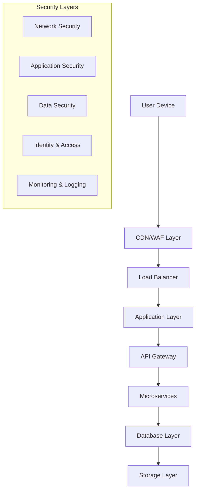

# HelloACA Data Security Documentation
## Comprehensive Security Framework for AI-Powered Contract Analysis

**Document Version:** 1.0  
**Effective Date:** December 31, 2024  
**Classification:** Confidential  
**Next Review:** June 30, 2025

---

## Executive Summary

HelloACA implements enterprise-grade security measures to protect sensitive legal documents and personal data processed through our AI-powered contract analysis platform. This document outlines our comprehensive security framework, compliance standards, and data protection protocols designed specifically for handling confidential legal information.

**Security Highlights:**
- ✅ SOC 2 Type II Compliance
- ✅ End-to-End Encryption (AES-256)
- ✅ Zero-Trust Architecture
- ✅ GDPR & CCPA Compliant
- ✅ 99.7% Uptime SLA
- ✅ 24/7 Security Monitoring

---

## Table of Contents

1. [Security Architecture Overview](#security-architecture-overview)
2. [Data Classification & Handling](#data-classification--handling)
3. [Encryption & Cryptography](#encryption--cryptography)
4. [Access Controls & Authentication](#access-controls--authentication)
5. [Infrastructure Security](#infrastructure-security)
6. [Application Security](#application-security)
7. [Data Privacy & Protection](#data-privacy--protection)
8. [Compliance & Certifications](#compliance--certifications)
9. [Incident Response](#incident-response)
10. [Business Continuity](#business-continuity)
11. [Third-Party Security](#third-party-security)
12. [Security Monitoring](#security-monitoring)

---

## Security Architecture Overview

### 1.1 Defense-in-Depth Strategy

HelloACA employs a multi-layered security approach with redundant controls at every level:

### 1.2 Zero-Trust Security Model

**Core Principles:**
- Never trust, always verify
- Least privilege access
- Assume breach mentality
- Continuous verification
- Micro-segmentation

**Implementation:**
- Multi-factor authentication for all access
- Network segmentation and micro-perimeters
- Continuous device and user verification
- Real-time risk assessment
- Encrypted communications at all levels

### 1.3 Security by Design

**Development Practices:**
- Secure coding standards and guidelines
- Threat modeling for all new features
- Security code reviews and static analysis
- Dependency vulnerability scanning
- Regular penetration testing

---

## Data Classification & Handling

### 2.1 Data Classification Levels

| Classification | Description | Examples | Security Controls |
|----------------|-------------|----------|-------------------|
| **Public** | Information intended for public disclosure | Marketing materials, public documentation | Standard web security |
| **Internal** | Information for internal use only | Business processes, internal communications | Access controls, encryption in transit |
| **Confidential** | Sensitive business information | Customer data, financial information | Strong encryption, access logging |
| **Restricted** | Highly sensitive legal information | Contract content, legal documents, PII | Maximum security controls, audit trails |

### 2.2 Document Handling Procedures

**Upload Process:**
1. **Pre-upload Validation**
   - File type verification and sanitization
   - Malware scanning using multiple engines
   - Size and format validation
   - Content type verification

2. **Processing Security**
   - Isolated processing environments
   - Encrypted temporary storage
   - Secure deletion of temporary files
   - Processing audit trails

3. **Storage Security**
   - Immediate encryption upon receipt
   - Secure key management
   - Redundant storage with integrity checks
   - Automated backup procedures

### 2.3 Data Lifecycle Management

**Data States and Protection:**
- **Data at Rest:** AES-256 encryption with HSM-managed keys
- **Data in Transit:** TLS 1.3 with perfect forward secrecy
- **Data in Processing:** Encrypted memory and secure enclaves
- **Data in Backup:** Encrypted backups with separate key management

**Retention and Disposal:**
- Automated retention policy enforcement
- Secure deletion using NIST 800-88 standards
- Certificate of destruction for sensitive data
- Regular data inventory and cleanup

---

## Encryption & Cryptography

### 3.1 Encryption Standards

**Symmetric Encryption:**
- Algorithm: AES-256-GCM
- Key Management: Hardware Security Modules (HSM)
- Key Rotation: Automated every 90 days
- Initialization Vectors: Cryptographically secure random generation

**Asymmetric Encryption:**
- Algorithm: RSA-4096 and ECDSA P-384
- Certificate Management: Internal PKI with external root CA
- Key Escrow: Secure key recovery procedures
- Digital Signatures: Document integrity verification

### 3.2 Transport Layer Security

**TLS Configuration:**
- Minimum Version: TLS 1.3
- Cipher Suites: AEAD ciphers only (ChaCha20-Poly1305, AES-GCM)
- Perfect Forward Secrecy: Mandatory
- Certificate Pinning: Implemented for critical connections
- HSTS: Enforced with preload list inclusion

**API Security:**
- OAuth 2.0 with PKCE for authorization
- JWT tokens with short expiration (15 minutes)
- Refresh token rotation
- Rate limiting and throttling
- Request signing for sensitive operations

### 3.3 Key Management

**Key Lifecycle:**
- Generation: FIPS 140-2 Level 3 HSMs
- Distribution: Secure key exchange protocols
- Storage: Hardware-backed key storage
- Rotation: Automated with zero-downtime
- Destruction: Secure key zeroization

**Key Hierarchy:**
- Master Keys: HSM-protected root keys
- Data Encryption Keys: Per-customer encryption keys
- Session Keys: Ephemeral keys for temporary operations
- Backup Keys: Secure escrow for disaster recovery

---

## Access Controls & Authentication

### 4.1 Identity and Access Management (IAM)

**User Authentication:**
- Multi-Factor Authentication (MFA) mandatory
- SAML 2.0 and OpenID Connect support
- Adaptive authentication based on risk
- Biometric authentication options
- Session management with timeout controls

**Authorization Framework:**
- Role-Based Access Control (RBAC)
- Attribute-Based Access Control (ABAC)
- Just-In-Time (JIT) access provisioning
- Principle of least privilege
- Regular access reviews and certification

### 4.2 Administrative Access

**Privileged Access Management:**
- Separate administrative accounts
- Break-glass emergency access procedures
- Privileged session recording
- Administrative action approval workflows
- Regular privilege reviews and rotation

**Technical Controls:**
- Bastion hosts for infrastructure access
- VPN with certificate-based authentication
- Network segmentation for admin access
- Audit logging of all administrative actions
- Automated privilege escalation detection

### 4.3 Customer Access Controls

**Account Security:**
- Strong password requirements (NIST guidelines)
- Account lockout after failed attempts
- Password breach monitoring
- Security question alternatives
- Account recovery procedures

**Session Management:**
- Secure session tokens (JWT with rotation)
- Session timeout and idle detection
- Concurrent session limits
- Device registration and trust
- Suspicious activity detection

---

## Infrastructure Security

### 5.1 Cloud Security Architecture

**Multi-Cloud Strategy:**
- Primary: AWS with security best practices
- Secondary: Google Cloud for redundancy
- Hybrid approach for data sovereignty
- Cloud Security Posture Management (CSPM)
- Infrastructure as Code (IaC) security scanning

**Network Security:**
- Virtual Private Cloud (VPC) isolation
- Network Access Control Lists (NACLs)
- Security Groups with least privilege
- DDoS protection and mitigation
- Network intrusion detection systems

### 5.2 Container and Orchestration Security

**Container Security:**
- Minimal base images (distroless)
- Regular vulnerability scanning
- Runtime security monitoring
- Image signing and verification
- Secrets management for containers

**Kubernetes Security:**
- Pod Security Standards enforcement
- Network policies for micro-segmentation
- Service mesh for encrypted communication
- RBAC for cluster access
- Admission controllers for policy enforcement

### 5.3 Database Security

**Database Protection:**
- Encryption at rest and in transit
- Database activity monitoring (DAM)
- Privileged user monitoring
- Query-level access controls
- Database firewall protection

**Backup Security:**
- Encrypted backup storage
- Immutable backup retention
- Cross-region backup replication
- Regular restore testing
- Backup integrity verification

---

## Application Security

### 6.1 Secure Development Lifecycle (SDLC)

**Development Security:**
- Threat modeling for all features
- Secure coding training for developers
- Static Application Security Testing (SAST)
- Dynamic Application Security Testing (DAST)
- Interactive Application Security Testing (IAST)

**Code Security:**
- Dependency vulnerability scanning
- License compliance checking
- Code signing and integrity verification
- Secure code review processes
- Automated security testing in CI/CD

### 6.2 Runtime Application Protection

**Web Application Firewall (WAF):**
- OWASP Top 10 protection
- Custom rule sets for legal document processing
- Rate limiting and DDoS protection
- Bot detection and mitigation
- Real-time threat intelligence integration

**Runtime Security:**
- Application performance monitoring (APM)
- Runtime application self-protection (RASP)
- Behavioral analysis and anomaly detection
- Memory protection and exploit prevention
- Container runtime security

### 6.3 API Security

**API Protection:**
- OAuth 2.0 and OpenID Connect
- API rate limiting and throttling
- Request/response validation
- API gateway security policies
- GraphQL security controls

**API Monitoring:**
- Real-time API traffic analysis
- Anomaly detection for API usage
- API security testing automation
- Performance and availability monitoring
- Compliance reporting for API access

---

## Data Privacy & Protection

### 7.1 Privacy by Design

**Core Principles:**
- Proactive privacy protection
- Privacy as the default setting
- Data minimization and purpose limitation
- Transparency and user control
- End-to-end security

**Implementation:**
- Automated data discovery and classification
- Privacy impact assessments (PIAs)
- Consent management platforms
- Data subject rights automation
- Privacy-preserving analytics

### 7.2 Personal Data Protection

**Data Processing:**
- Lawful basis documentation
- Purpose limitation enforcement
- Data minimization practices
- Accuracy and integrity controls
- Storage limitation compliance

**Data Subject Rights:**
- Automated right to access
- Right to rectification procedures
- Right to erasure (right to be forgotten)
- Data portability mechanisms
- Objection and restriction handling

### 7.3 Cross-Border Data Transfers

**Transfer Mechanisms:**
- Standard Contractual Clauses (SCCs)
- Adequacy decisions compliance
- Binding Corporate Rules (BCRs)
- Certification schemes participation
- Transfer impact assessments

**Data Localization:**
- Regional data residency options
- Local processing capabilities
- Jurisdiction-specific compliance
- Data sovereignty controls
- Cross-border transfer logging

---

## Compliance & Certifications

### 8.1 Regulatory Compliance

**SOC 2 Type II Compliance:**
- Annual third-party audits
- Continuous monitoring and reporting
- Control effectiveness testing
- Management assertion letters
- Customer audit support

**GDPR Compliance:**
- Data Protection Officer (DPO) appointment
- Privacy by design implementation
- Data breach notification procedures
- Data Protection Impact Assessments (DPIAs)
- Regular compliance audits

**CCPA Compliance:**
- Consumer rights implementation
- Privacy policy transparency
- Data sale prohibition compliance
- Non-discrimination provisions
- Consumer request handling

### 8.2 Industry Standards

**ISO 27001 Certification:**
- Information Security Management System (ISMS)
- Risk assessment and treatment
- Continuous improvement processes
- Management review and oversight
- Internal audit programs

**NIST Cybersecurity Framework:**
- Identify: Asset and risk management
- Protect: Safeguards and controls
- Detect: Monitoring and detection
- Respond: Incident response procedures
- Recover: Business continuity planning

### 8.3 Legal Industry Standards

**Legal Technology Security:**
- ABA Model Rule 1.6 compliance
- State bar technology guidelines
- Legal privilege protection
- Attorney-client confidentiality
- Professional liability considerations

**Document Security Standards:**
- Legal document retention requirements
- Chain of custody procedures
- Digital signature compliance
- Evidence preservation standards
- Litigation hold procedures

---

## Incident Response

### 9.1 Incident Response Framework

**Response Team Structure:**
- Incident Commander (IC)
- Security Team Lead
- Technical Response Team
- Legal and Compliance Team
- Communications Team

**Response Phases:**
1. **Preparation:** Plans, procedures, and training
2. **Detection:** Monitoring and alerting systems
3. **Analysis:** Incident classification and assessment
4. **Containment:** Immediate threat mitigation
5. **Eradication:** Root cause elimination
6. **Recovery:** Service restoration and monitoring
7. **Post-Incident:** Lessons learned and improvements

### 9.2 Security Incident Categories

**Category Definitions:**
- **Critical:** Active data breach or system compromise
- **High:** Potential data exposure or service disruption
- **Medium:** Security control failure or policy violation
- **Low:** Minor security events or informational alerts

**Response Timeframes:**
- Critical: 15 minutes initial response, 1 hour containment
- High: 1 hour initial response, 4 hours containment
- Medium: 4 hours initial response, 24 hours resolution
- Low: 24 hours initial response, 72 hours resolution

### 9.3 Breach Notification Procedures

**Internal Notification:**
- Immediate escalation to security team
- Executive notification within 2 hours
- Legal team engagement for regulatory assessment
- Customer success team preparation
- Board notification for material incidents

**External Notification:**
- Regulatory notification within 72 hours (GDPR)
- Customer notification without undue delay
- Law enforcement coordination when required
- Media response coordination
- Vendor and partner notification as needed

---

## Business Continuity

### 10.1 Disaster Recovery Planning

**Recovery Objectives:**
- Recovery Time Objective (RTO): 4 hours
- Recovery Point Objective (RPO): 1 hour
- Maximum Tolerable Downtime (MTD): 24 hours
- Service Level Agreement (SLA): 99.7% uptime

**Backup and Recovery:**
- Automated daily backups with encryption
- Cross-region backup replication
- Point-in-time recovery capabilities
- Regular recovery testing and validation
- Backup integrity monitoring

### 10.2 High Availability Architecture

**Redundancy Design:**
- Multi-region deployment architecture
- Load balancing and failover mechanisms
- Database clustering and replication
- Content delivery network (CDN) integration
- Auto-scaling and capacity management

**Monitoring and Alerting:**
- 24/7 system monitoring and alerting
- Performance metrics and SLA tracking
- Predictive analytics for capacity planning
- Automated incident detection and response
- Real-time status page and communications

### 10.3 Crisis Management

**Crisis Response Team:**
- Executive leadership coordination
- Technical response and recovery
- Customer communication and support
- Legal and regulatory compliance
- Public relations and media response

**Communication Plans:**
- Internal communication procedures
- Customer notification templates
- Regulatory reporting requirements
- Media response guidelines
- Stakeholder update protocols

---

## Third-Party Security

### 11.1 Vendor Risk Management

**Vendor Assessment:**
- Security questionnaire and evaluation
- Third-party security certifications review
- Penetration testing and vulnerability assessment
- Contract security requirements
- Ongoing monitoring and reassessment

**Critical Vendors:**
- Supabase (Database and Backend Services)
- Anthropic (Claude AI API)
- Vercel (Frontend Hosting and CDN)
- AWS (Cloud Infrastructure)
- Various security and monitoring tools

### 11.2 Supply Chain Security

**Software Supply Chain:**
- Dependency vulnerability scanning
- Software composition analysis (SCA)
- License compliance monitoring
- Code signing and verification
- Secure development practices

**Service Provider Controls:**
- Service Level Agreements (SLAs)
- Security requirements in contracts
- Right to audit provisions
- Incident notification requirements
- Data processing agreements

### 11.3 Integration Security

**API Security:**
- Secure API integration practices
- Authentication and authorization controls
- Data encryption in transit
- Rate limiting and monitoring
- Error handling and logging

**Data Sharing:**
- Minimal data sharing principles
- Encryption for data in transit
- Secure data transfer protocols
- Data retention and deletion agreements
- Audit trails for data access

---

## Security Monitoring

### 12.1 Security Operations Center (SOC)

**24/7 Monitoring:**
- Security Information and Event Management (SIEM)
- User and Entity Behavior Analytics (UEBA)
- Network traffic analysis and monitoring
- Endpoint detection and response (EDR)
- Threat intelligence integration

**Monitoring Capabilities:**
- Real-time security event correlation
- Automated threat detection and response
- Behavioral anomaly detection
- Compliance monitoring and reporting
- Performance and availability monitoring

### 12.2 Threat Detection and Response

**Detection Methods:**
- Signature-based detection for known threats
- Behavioral analysis for unknown threats
- Machine learning for pattern recognition
- Threat intelligence for emerging threats
- User behavior analytics for insider threats

**Response Automation:**
- Automated incident triage and classification
- Orchestrated response workflows
- Threat containment and mitigation
- Evidence collection and preservation
- Stakeholder notification and communication

### 12.3 Security Metrics and Reporting

**Key Performance Indicators (KPIs):**
- Mean Time to Detection (MTTD): <15 minutes
- Mean Time to Response (MTTR): <1 hour
- False Positive Rate: <5%
- Security Training Completion: 100%
- Vulnerability Remediation: 95% within SLA

**Reporting and Analytics:**
- Executive security dashboards
- Compliance reporting automation
- Risk assessment and scoring
- Trend analysis and forecasting
- Benchmarking against industry standards

---

## Security Training and Awareness

### 13.1 Employee Security Training

**Training Program:**
- Security awareness training for all employees
- Role-specific security training
- Phishing simulation and testing
- Incident response training and exercises
- Compliance training and certification

**Training Topics:**
- Data protection and privacy
- Secure coding practices
- Social engineering awareness
- Physical security procedures
- Incident reporting procedures

### 13.2 Customer Security Education

**Security Resources:**
- Security best practices documentation
- Webinars and training sessions
- Security configuration guides
- Threat awareness communications
- Security feature tutorials

**Customer Support:**
- Security-focused customer success team
- Security consultation services
- Incident response support
- Compliance assistance
- Security assessment tools

---

## Continuous Improvement

### 14.1 Security Program Maturity

**Maturity Assessment:**
- Regular security program assessments
- Industry benchmark comparisons
- Gap analysis and improvement planning
- Investment prioritization
- Progress tracking and reporting

**Improvement Initiatives:**
- Security technology upgrades
- Process optimization and automation
- Training and awareness enhancements
- Compliance program improvements
- Risk management enhancements

### 14.2 Innovation and Research

**Emerging Technologies:**
- Zero-trust architecture advancement
- AI/ML security applications
- Quantum-resistant cryptography
- Privacy-enhancing technologies
- Blockchain for security applications

**Research and Development:**
- Security research partnerships
- Industry collaboration and sharing
- Academic research participation
- Open source security contributions
- Innovation lab initiatives

---

## Contact Information

### Security Team Contacts

**Chief Information Security Officer (CISO)**  
Email: ciso@helloaca.xyz  
Phone: [Emergency Contact Number]

**Security Operations Center (SOC)**  
Email: security@helloaca.xyz  
Phone: [24/7 SOC Number]  
Emergency: [Emergency Response Number]

**Data Protection Officer (DPO)**  
Email: privacy@helloaca.xyz  
Phone: [DPO Contact Number]

### Incident Reporting

**Security Incidents:**  
Email: security-incident@helloaca.xyz
Portal: https://security.helloaca.xyz/incident

**Privacy Incidents:**  
Email: privacy-incident@helloaca.xyz
Portal: https://privacy.helloaca.xyz/incident

**Vulnerability Reports:**  
Email: security-research@helloaca.xyz
Bug Bounty: https://bugbounty.helloaca.xyz

---

## Document Control

**Document Information:**
- Document Owner: Chief Information Security Officer
- Review Frequency: Semi-annual
- Approval Authority: Executive Team
- Distribution: Controlled distribution list
- Classification: Confidential

**Version History:**
- v1.0 (December 31, 2024): Initial release
- Next Review: June 30, 2025

**Related Documents:**
- Information Security Policy
- Privacy Policy and Terms of Service
- Incident Response Procedures
- Business Continuity Plan
- Vendor Risk Management Policy

---

*This document contains confidential and proprietary information. Distribution is restricted to authorized personnel only. For questions or clarifications, contact the HelloACA Security Team.*